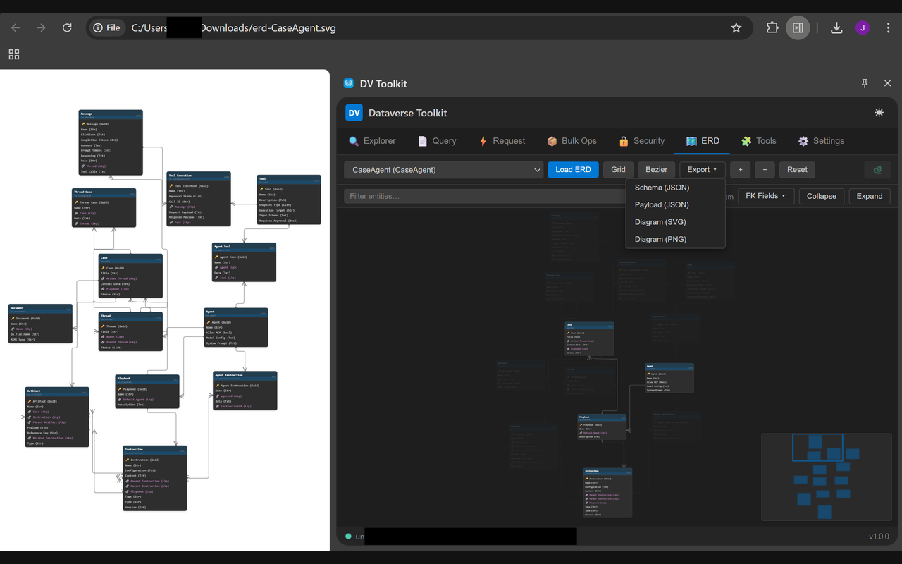
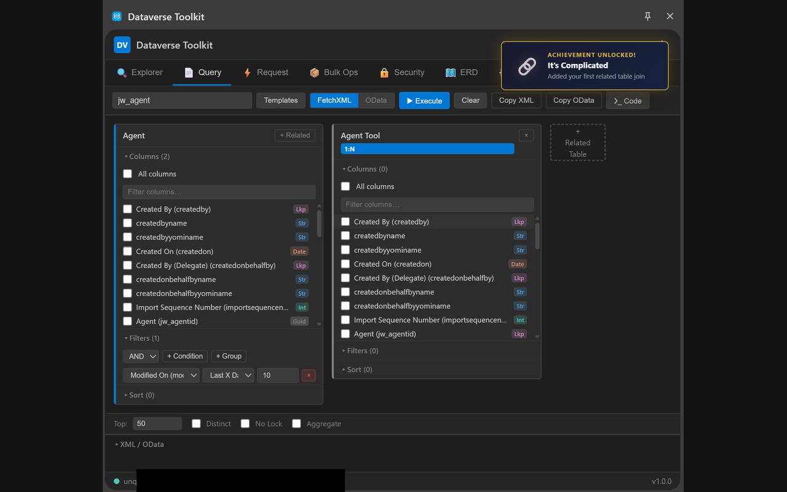
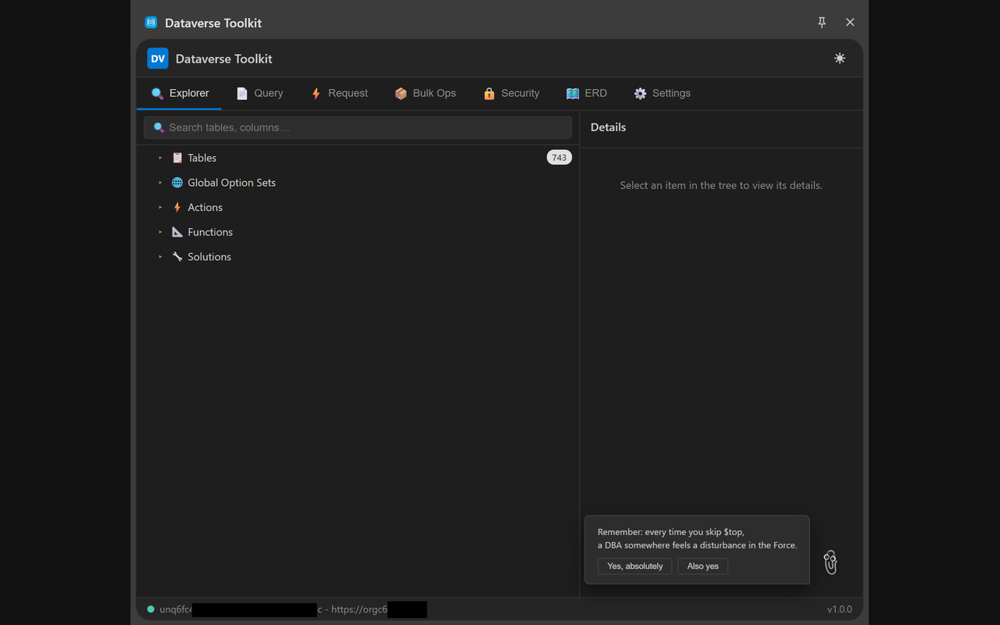

# Dataverse Chrome Plugin

AI-native Developer Toolkit for Dynamics 365 — BYOK Agent with full plugin access, ERD Viewer, Skill Sharing.

Open Source (MIT) · Chrome Extension · Zero Dependencies · No Backend

---

<table>
<tr>
<td width="50%" valign="top">

### Business Goal

- AI-native alternative to the native Solution Explorer — from schema browsing and query building to a BYOK Agent that uses every plugin feature as a tool
- Agent learns from trial-and-error and stores successful interactions as reusable Skills shared via Dataverse across the team

</td>
<td width="50%" valign="top">

### Impact

- **AI Agent First Experience** — the agent works more efficiently with Dataverse than manual workflows or MCP alone
- **Skill Sharing via Dataverse** eliminates repeated trial-and-error across team members
- **ERD Viewer** replaces manual Data Model documentation
- **Fully Client-Side** — no server, no data leaves the browser (except BYOK API calls)

</td>
</tr>
</table>

---

### Architecture Highlights

- Zero external dependencies — Vanilla JS, ES Modules, pure SVG (<500KB unpacked)
- BYOK Agent with support for Azure OpenAI, OpenAI, and Anthropic APIs (ChatCompletions & Responses)
- Agent uses all plugin features as tools — navigates UI, fills forms, creates entities, builds views
- Skill System: successful agent interactions stored as categorized, reusable skills — users can create/edit (with human approval only)
- Skills injectable in system message; agent sees all skill descriptions and tags to pick relevant context
- ERD Viewer: auto-generated Data Model Diagrams per solution — no manual documentation needed
- Entity-as-Tool JSON Export — bridge Dataverse schema directly into agent tooling
- Schema Browser, FetchXML/OData Query Builder, Bulk Operations, Security Analysis

<table>
<tr>
<td width="50%" valign="top">

### Tech Stack
Vanilla JavaScript · Chrome Extension API · Claude Code

</td>
<td width="50%" valign="top">

### Integrations
Dynamics 365 · Dataverse

</td>
</tr>
</table>

---

## Screenshots

<p align="center">
  
</p>
<p align="center"><em>ERD Viewer — auto-generated entity-relationship diagrams from any solution, exported as SVG</em></p>

<p align="center">
  
  
</p>
<p align="center"><em>Query Builder with related table joins &nbsp;|&nbsp; Schema Explorer with 743 tables</em></p>

---

## Features

| Category | Capabilities |
|----------|-------------|
| **Dataverse Agent** | BYOK conversational AI (OpenAI / Azure / Anthropic) with 28 built-in tools. Navigates UI, queries data, creates records, publishes entities. Multi-turn agent loop with confirmation gates for destructive ops. |
| **Schema & Exploration** | VS Code-style tree browser for tables, columns, relationships, keys, forms, views, option sets, custom APIs, solutions. |
| **Query Building** | Visual FetchXML / OData builder with type-aware filters, OptionSet dropdowns, related table joins (N:1 / 1:N / N:N), inline execution, code generation (C#, JS, Power Automate). |
| **API & Bulk Ops** | Raw HTTP tool with entity autocomplete and code gen. Batch wizard for bulk create/update/delete, status toggle, reassign, deep insert, CMT export/import. |
| **Security** | Role-privilege matrix, user permission lookup, field-level security profiles. |
| **ERD** | Interactive ER diagrams from solutions — force-directed or grid layout, crow's foot notation, minimap, export as SVG/PNG/JSON Schema. Documentation-grade mode with print-ready export. |
| **Tool Builder** | Generate JSON Schema tool definitions (Claude / OpenAI / MCP) from any entity with deep insert support. |
| **Skill System** | Store, categorize, and share successful agent interactions. Human approval required. Skills auto-injected into agent context. |

---

## Installation

1. [Download the latest release](../../releases/latest) or clone this repo
2. `chrome://extensions` → enable **Developer mode** → **Load unpacked** → select project folder
3. Navigate to any Dynamics 365 environment, sign in, and open the side panel

**Requires:** Chrome 114+ · Dynamics 365 / Power Platform environment

---

## How It Works

```
Side Panel  →  Background Service Worker  →  Content Script (MAIN world)  →  Dataverse Web API
```

The side panel is CORS-blocked from `*.dynamics.com`. Requests route through a MAIN world content script that inherits session cookies — no OAuth tokens or service accounts needed. The agent orchestrates all modules via a Module Bridge that exposes read/navigate operations.

---

## Easter Eggs

| Trigger | What happens |
|---------|-------------|
| Konami Code | Matrix Rain — entity names fall from the sky |
| Double-click the snake icon in ERD | Snake game with entity boxes as food |
| Random actions (15% chance) | Clippy with sarcastic Dataverse comments |
| Various milestones | 18 achievements, persisted across sessions |

---

## License

MIT
