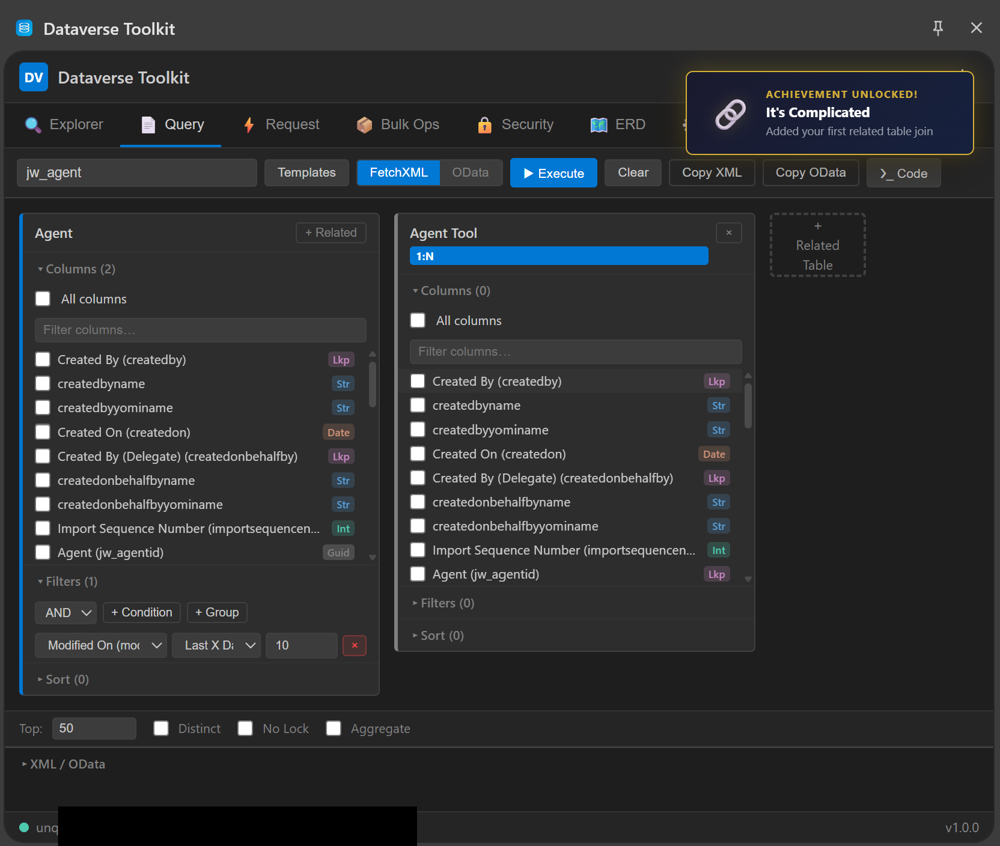

# Dataverse Toolkit

A Chrome Extension for Dynamics 365 / Power Platform developers, built entirely through vibe coding with Claude. No frameworks, no build tools, no dependencies — just raw ES modules, SVG, and a side panel that does more than most standalone apps.

Every feature was designed and implemented in conversation, from the first API proxy to the force-directed ERD layout. The result is a zero-dependency developer toolkit that runs entirely in the browser.

## Installation

1. [Download the latest release as a ZIP](../../releases/latest) (or clone this repo)
2. Open `chrome://extensions` in Chrome
3. Enable **Developer mode** (top right toggle)
4. Click **Load unpacked** and select the project folder
5. Navigate to any Dynamics 365 / Power Platform environment and sign in
6. Open the side panel via the extension icon

**Requirements:** Google Chrome 114+ · Access to a Dynamics 365 / Power Platform environment

---

## Features

### API Explorer

Browse your entire Dataverse schema in a VS Code-style tree. Tables, columns, relationships, keys, forms, views, global option sets, custom APIs (actions/functions), and solutions — with full metadata details and virtual scrolling for large orgs.

 

---

### Query Builder (FetchXML)

Visual node-card query builder. Each table appears as a card with:
- Checkable columns with attribute type badges
- Nested filter groups (AND/OR, type-aware operators, OptionSet dropdowns for picklists)
- Sort rows with drag-and-drop reordering
- "+ Add Related Table" with relationship picker (N:1 / 1:N / N:N)

Switch between **FetchXML** and **OData** output. Execute and view results inline. Code generation in C#, JavaScript, and Power Automate HTTP action.

  

---

### Request Builder
<!-- screenshot: request builder with entity autocomplete open, response panel showing JSON -->

Craft any Web API request with entity autocomplete, OData query options (auto-disabled when a record ID is entered), a header preset library, and a full response viewer with syntax highlighting. Requests are saved to history with favorites. Code generation in JavaScript, C#, Python, and cURL.

---

### Bulk Operations
<!-- screenshot: bulk ops tab with two operation cards in different-colored changesets, templates menu open -->

Build and execute `$batch` requests with a wizard system:

| Wizard | What it does |
|--------|-------------|
| **Bulk Create** | Form mode or CSV paste → POST operations |
| **Bulk Update** | OData filter → fetch records → PATCH with new values |
| **Bulk Delete** | Type entity name to confirm → DELETE operations |
| **Status Toggle** | Change statecode/statuscode across matching records |
| **Bulk Assign** | Reassign record ownership to a user or team |
| **Deep Insert** | POST a parent record with nested child records in one call |
| **Data Export (CMT)** | Export records as Configuration Migration Tool zip (data_schema.xml + data.xml) |
| **Data Import (CMT)** | Upload a CMT zip → review entities → upsert or create |

Supports ChangeSets (transactional groups), drag-and-drop reordering, and a guided single-operation builder with type-aware inputs for every field type.

---

### Security Inspector
<!-- screenshot: security tab showing role privilege matrix with depth indicators (User/BU/Parent/Org) -->

- Role-privilege matrix per entity (Create/Read/Write/Delete/Append/AppendTo/Assign/Share with depth indicators)
- User permission lookup via `RetrieveUserPrivileges` (all privileges across direct + team roles)
- Field-level security profiles
- Audit configuration viewer

---

### ERD Viewer
<!-- screenshot: ERD tab showing 6 entity boxes connected by arrows with crow's foot notation, detail panel open on right -->

Load any unmanaged Dataverse solution and get a fully interactive entity-relationship diagram:

- **Force-directed layout** with Fruchterman-Reingold physics, toggle to grid with animated transitions
- **Entity dragging** — grab any box, arrows follow with requestAnimationFrame throttling
- **Crow's foot notation** — proper ERD markers (||, fork) for 1:N and N:N cardinality
- **N:N relationships** rendered with distinct dotted styling + intersect entity tooltip
- **Orthogonal routing** — clean Manhattan-style lines with lane offsets; toggle to Bezier
- **Relationship highlighting** — hover to highlight connections, fade everything else
- **Minimap** — canvas overview with viewport indicator, click to navigate
- **Per-entity column chooser** and FK field filter to reduce visual noise
- **SVG & PNG export**, **JSON Schema draft-07 export**, **example payload export**
- **Keyboard shortcuts** — `+`/`-` zoom, `0` reset, `f` filter, `Escape` clear selection

All in ~1500 lines of vanilla JS and SVG — no D3, no Cytoscape, no graph library.

---

### Settings
<!-- screenshot: settings tab showing theme toggle and connection info -->

Theme switching (light/dark), connection status, metadata cache management.

---

## Architecture

```
Dynamics 365 page (*.dynamics.com)
  └─ content-script.js  (ISOLATED world)
       └─ page-extractor.js  (MAIN world)  ← runs at org origin, has session cookies

Side Panel  ──────────────────────────────────────
  app.js  (bootstrap, tab routing, MetadataCache)
  modules/  (one class per tab, lazy-loaded)
     └─ apiClient.request() → chrome.runtime.sendMessage

Background Service Worker
  proxyApiRequest() → sendMessage to tab content script
                          └─ page-extractor.js fetch() → Dataverse Web API
```

**Why this routing:** The side panel runs at `chrome-extension://`, which is CORS-blocked from all `*.dynamics.com` endpoints. The MAIN world content script runs at the page's own origin and inherits session cookies — no Bearer token needed.

- **No build system** — pure ES modules, no bundler
- **No external dependencies** — built from scratch
- **No backend** — everything runs in the browser

---

## Skills & Patterns

The `skills/` folder contains transferable engineering knowledge extracted from building this project. Useful if you want to build something similar:

| Skill | What it covers |
|-------|---------------|
| [skills/dataverse-api-gotchas.md](skills/dataverse-api-gotchas.md) | Non-obvious Dataverse Web API behaviors: metadata endpoint limits, privilege resolution, FetchXML URL requirements, N:N expand limitations, `$batch` parsing |
| [skills/chrome-mv3-patterns.md](skills/chrome-mv3-patterns.md) | Chrome MV3 patterns: CORS bypass via MAIN world content script, service worker state survival, content script re-injection after dev reload, ES modules without bundlers |

See [CLAUDE.md](CLAUDE.md) for full architecture docs used by Claude when working on this project.

---

## Easter Eggs

| Trigger | What happens |
| ------- | ------------ |
| `↑ ↑ ↓ ↓ ← → ← → B A` (Konami Code) | Matrix Rain — entity names fall from the sky, dangerous words (DROP, DELETE) in red |
| Double-click `🐍` in the ERD toolbar | Snake game — eat entity boxes, their names appear in the snake body. Every 3rd entity triggers a "deleted from production" toast |
| Various actions (15% chance) | Clippy shows up with sarcastic comments |
| Milestones | 18 achievements, persisted across sessions (visible in Settings tab) |

<details>
<summary>All 18 achievements</summary>

| Icon | Title | How to unlock |
| ---- | ----- | ------------- |
| 🏁 | First Steps | Execute your first query |
| 📊 | Data Hoarder | Retrieve 100+ records in one query |
| 🗄️ | Data Warehouse | Retrieve 1000+ records in one query |
| 🔗 | It's Complicated | Add your first related table join |
| 💀 | Living Dangerously | Add a N:N join |
| 📦 | Bulk Believer | Execute your first batch operation |
| 🚀 | Batch Boss | Execute 100+ operations in one batch |
| 🗺️ | Cartographer | Load your first ERD diagram |
| 🏗️ | Architect | ERD with 10+ entities |
| 👑 | The Chosen One | View System Administrator privileges |
| 🔐 | Fort Knox | Explore field-level security |
| 📋 | Copy Pasta | Copy something to clipboard 10 times |
| 🦉 | Night Owl | Use the toolkit after midnight |
| 🐦 | Early Bird | Use the toolkit before 6 AM |
| ⚡ | Speed Demon | Query returns in under 50ms |
| 🔭 | Deep Space Explorer | Browse an org with 500+ entities |
| 🐍 | Snake Charmer | Score 50+ in Snake |
| 🕹️ | Old School | Enter the Konami Code |

</details>

---

## Vibe Coding

This project was built entirely through iterative conversation with Claude — describing features, reviewing screenshots, adjusting behavior, and pushing the boundaries of what's possible without dependencies.

A few things that stood out:

- **The ERD viewer** went through multiple rounds of layout fixes, arrow routing, system field filtering, and export polish — each fixed in conversation without touching a code editor
- **The wizard system** (6 wizards + CMT export/import) was built using a parallel subagent wave strategy: foundation modules in wave 1, wizard implementations in wave 2, integration in wave 3 — roughly 4x faster than sequential implementation
- **Zero dependencies** was a deliberate constraint that forced creative solutions: browser-native zip parsing via `DecompressionStream`, SVG ERD rendering without D3, force-directed layout from scratch with Fruchterman-Reingold physics

The `skills/` folder is a direct byproduct — patterns that emerged from hitting real Dataverse API limitations and Chrome MV3 edge cases, extracted so future Claude sessions (or other developers) can skip the trial and error.

## License

MIT
