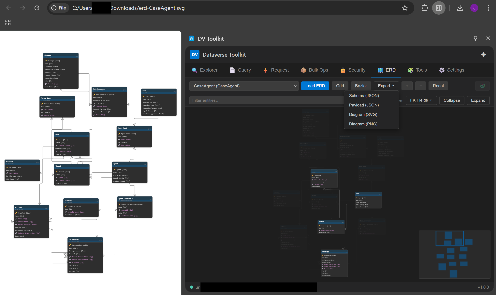
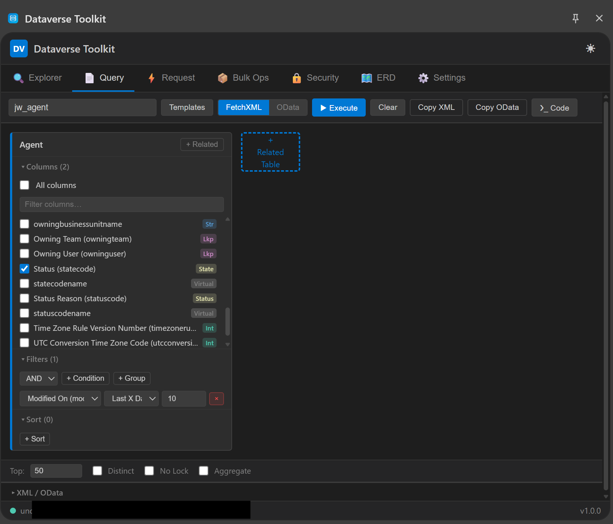
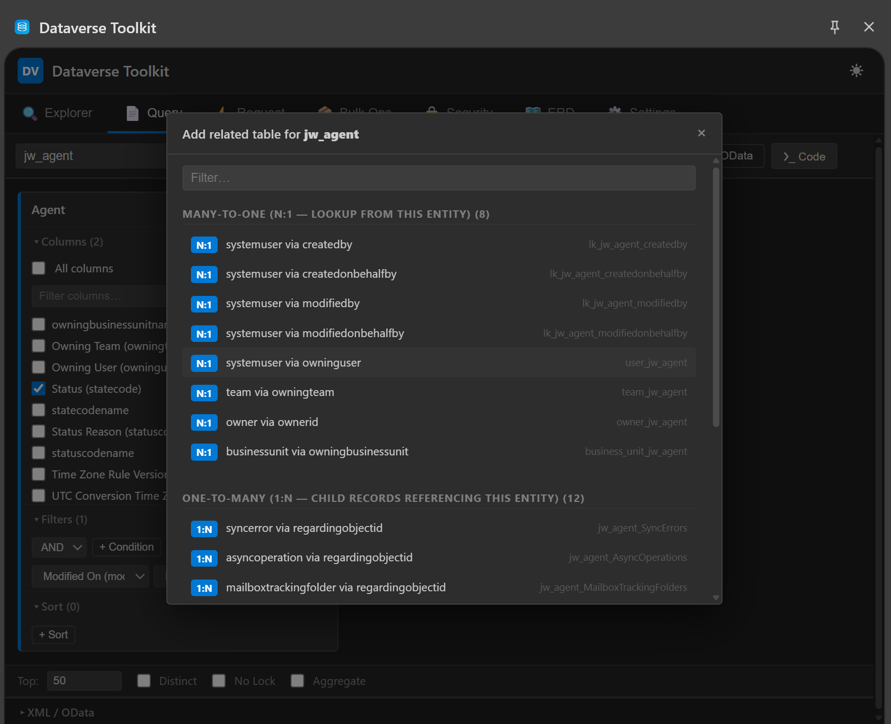
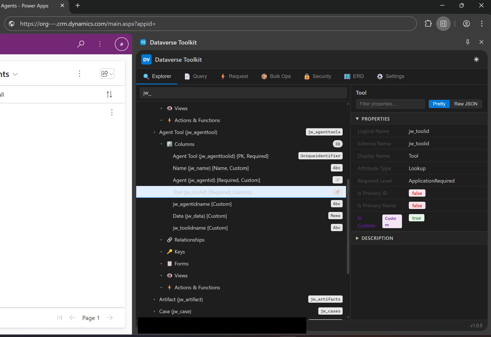
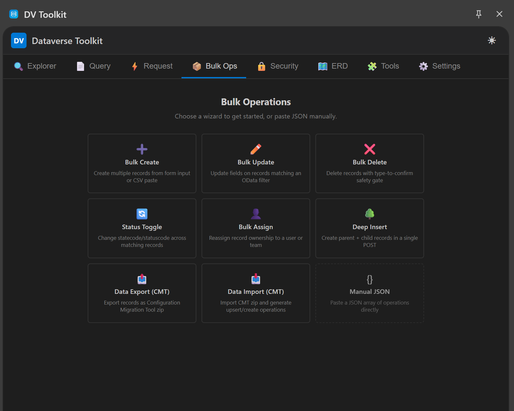
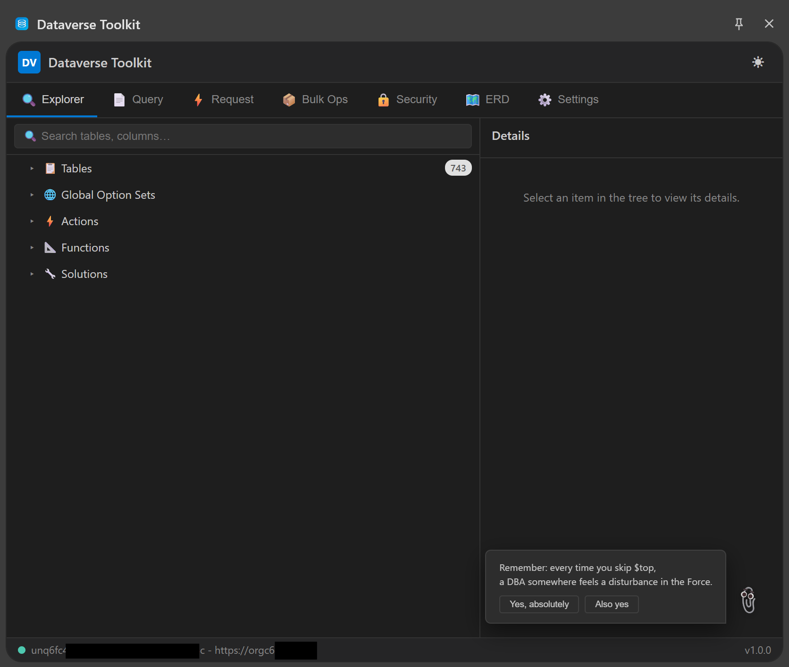

# Dataverse Toolkit

A Chrome Extension for Dynamics 365 / Power Platform developers. No frameworks, no build tools, no dependencies — just raw ES modules and a side panel that does more than most standalone apps.

## Installation

1. [Download the latest release](../../releases/latest) or clone this repo
2. `chrome://extensions` → enable **Developer mode** → **Load unpacked** → select project folder
3. Navigate to any Dynamics 365 environment, sign in, and open the side panel

**Requires:** Chrome 114+ · Dynamics 365 / Power Platform environment

---

## Highlights

### AI Customizer (BYOK)

Modify and create Dataverse views using natural language. Bring your own API key (OpenAI, Azure OpenAI, Anthropic, or any compatible endpoint).

The agent automatically fetches related entity metadata, asks clarifying questions when needed, and shows a color-coded XML diff before applying changes. Follow-up prompts build on previous context — no re-explaining. Includes validation that blocks broken XML before it hits your environment, a revert button for every change, and a debug console that logs every API call.

> **Warning:** This modifies live Dataverse views. Always test on non-critical views first.

### ERD Viewer

Load any unmanaged solution and get a fully interactive entity-relationship diagram — force-directed layout, crow's foot notation, orthogonal routing, minimap, and drag-and-drop. Export as SVG, PNG, JSON Schema (draft-07), or example payloads. All in vanilla JS and SVG, no graph library.



### Query Builder (FetchXML)

Visual card-based query builder with type-aware filters, OptionSet dropdowns, drag-and-drop sort, and related table joins (N:1 / 1:N / N:N). Switch between FetchXML and OData output, execute inline, generate code in C#, JavaScript, and Power Automate.

 

---

## All Features

| Tab | What it does |
|-----|-------------|
| **API Explorer** | VS Code-style schema tree — tables, columns, relationships, keys, forms, views, option sets, custom APIs, solutions |
| **Query Builder** | Visual FetchXML / OData builder with inline execution and code generation |
| **Request Builder** | Raw HTTP tool with entity autocomplete, header presets, history, and code generation (JS, C#, Python, cURL) |
| **Bulk Operations** | `$batch` wizard system — bulk create/update/delete, status toggle, reassign, deep insert, CMT export/import |
| **Security Inspector** | Role-privilege matrix, user permission lookup, field-level security profiles, audit config |
| **ERD Viewer** | Interactive ER diagrams from solutions with multiple layout engines and export formats |
| **Agent Tool Builder** | Generate JSON Schema tool definitions (Claude/OpenAI/MCP) from any entity, with deep insert support |
| **AI Customizer** | BYOK conversational agent for view modification and creation with validation and revert |
| **Form Inspector** | Read live Xrm.Page context — field values, form type, control states |
| **Settings** | Themes, cache TTL, AI provider config |

  

---

## Architecture

Zero dependencies, no build system, no backend. The side panel is CORS-blocked from Dynamics 365, so requests route through a MAIN world content script that inherits session cookies — no OAuth tokens needed.

```
Side Panel → Background Worker → Content Script → Page Extractor → Dataverse Web API
```

Each tab is a lazy-loaded module sharing an API client and metadata cache. See **[ARCHITECTURE.md](ARCHITECTURE.md)** for the full deep-dive.

---

## Easter Eggs

| Trigger | What happens |
|---------|-------------|
| Konami Code | Matrix Rain — entity names fall from the sky |
| Double-click the snake icon in ERD | Snake game with entity boxes as food |
| Random actions (15% chance) | Clippy with sarcastic comments |
| Various milestones | 18 achievements, persisted across sessions |

<details>
<summary>All 18 achievements</summary>

| Icon | Title | How to unlock |
|------|-------|---------------|
| 🏁 | First Steps | Execute your first query |
| 📊 | Data Hoarder | Retrieve 100+ records in one query |
| 🗄️ | Data Warehouse | Retrieve 1000+ records in one query |
| 🔗 | It's Complicated | Add your first related table join |
| 💀 | Living Dangerously | Add a N:N join |
| 📦 | Bulk Believer | Execute your first batch operation |
| 🚀 | Batch Boss | Execute 100+ operations in one batch |
| 🗺️ | Cartographer | Load your first ERD diagram |
| 🏗️ | Architect | ERD with 10+ entities |
| 👑 | The Chosen One | View System Administrator privileges |
| 🔐 | Fort Knox | Explore field-level security |
| 📋 | Copy Pasta | Copy something to clipboard 10 times |
| 🦉 | Night Owl | Use the toolkit after midnight |
| 🐦 | Early Bird | Use the toolkit before 6 AM |
| ⚡ | Speed Demon | Query returns in under 50ms |
| 🔭 | Deep Space Explorer | Browse an org with 500+ entities |
| 🐍 | Snake Charmer | Score 50+ in Snake |
| 🕹️ | Old School | Enter the Konami Code |

</details>

---

## Skills

The [skills/](skills/) folder contains transferable patterns extracted from this project — Dataverse API gotchas and Chrome MV3 techniques. See [CLAUDE.md](CLAUDE.md) for the full project guide.

## License

MIT
