# Codebase Knowledge Atlas — Dataverse Toolkit

> Synthesized from 17 structured subsystem audits of the current (`main`) build, reconciled against `CLAUDE.md`, `ARCHITECTURE.md`, `README.md`, `CONTEXT.md`, ADR-0001 and ADR-0002.
>
> Purpose: let a senior developer or an AI agent navigate and reason about the *existing* tool without re-reading every file. This describes **what is**, not what the rewrite intends — where docs and code disagree, the **code wins** and the gap is recorded in §9.
>
> Ground-truth note: tool/LOC/tab counts here are taken from the audits' line-count verification. Headline doc claims ("28 tools", "5K Bulk Ops") are frequently wrong; this Atlas uses the verified numbers and flags the divergence.
>
> **Post-critique corrections (applied):** A completeness/accuracy critic re-verified this Atlas and caught three of its own overcounts, now fixed below: (1) the salvage-ledger total is **~48,250 LOC for the whole repo** (src+test+manifest), not the "~53,800" first drafted — the per-subsystem table sums recurring shared files (app.js, api-client, page-extractor, service-worker, detail-panel each appear under several subsystems), so the table column over-adds by ~5,600; (2) **CSS total ≈ 5,457 LOC in `styles/` files**, plus inlined CSS that is *already counted inside its host JS files* — the earlier "~9,400 CSS" double-counted those inlined lines; (3) ERD v2 is **13 sub-modules in `erd-v2/` + the `erd-v2.js` orchestrator** — CLAUDE.md's "13 sub-modules" is correct; only its LOC budget (2,000 vs actual 3,134) was off. The 25-tool count, the `search_entities`→`get_entities` phantom, the Authoring-precursor and Dataverse-skill-store findings all held under re-verification.

---

## 1. Executive map

The Dataverse Toolkit is a **Chrome MV3 side-panel** developer tool for Dynamics 365 / Power Platform. It has **no backend and no build step**; one vendored library (`@dagrejs/dagre` v3) is used for ERD layout. It turns a live Dataverse environment into a multi-tab workspace: schema browser, FetchXML/OData query builder, raw HTTP request builder, $batch bulk-ops, security inspector, two ERD viewers, an entity→tool-schema builder, a form inspector, and a BYOK AI agent ("Dataverse Agent") that can read and drive every other tab via a Module Bridge.

### Runtime topology

There are **six** distinct extension surfaces, only four of which the docs acknowledge:

| Surface | Origin / world | Role |
|---|---|---|
| **Side panel** (`src/sidepanel/`) | `chrome-extension://` | The main app. `app.js` is the shell; 11 lazy-loaded tab modules. |
| **Background service worker** (`src/background/service-worker.js`) | extension SW | Central message router + API proxy + metadata cache + DevTools log + tab lifecycle. Killed after ~30s idle. |
| **Content script** (`src/content/content-script.js`) | ISOLATED world @ `*.dynamics.com` | Relay between SW `chrome.runtime` messages and MAIN-world `window.postMessage`. |
| **Page extractor** (`src/content/page-extractor.js`) | MAIN world @ `*.dynamics.com` | Same-origin `fetch()` (session cookies), `Xrm` env extraction, `Xrm.Page` form ops. |
| **DevTools panel** (`src/devtools/`) | DevTools page | Live API-log tail. **Undocumented** in CLAUDE.md/ADR. |
| **Popup** (`src/popup/`) | toolbar action popup | Connection status, side-panel launcher, WhoAmI / clear-cache / theme toggle. **Undocumented.** |

### The 3-hop CORS bridge (the load-bearing trick)

The side panel's `chrome-extension://` origin is CORS-blocked from all `*.dynamics.com` endpoints, and there is no server to proxy through. The fix is a three-hop relay that ends in a **MAIN-world `fetch()` with `credentials:'same-origin'`**, so the page's existing Dataverse session cookie authenticates automatically — **there is no OAuth, no Bearer token**:

```
Side panel  ──chrome.runtime.sendMessage(API_REQUEST)──▶  Service Worker
Service Worker  ──chrome.tabs.sendMessage(PROXY_VIA_PAGE)──▶  content-script (ISOLATED)
content-script  ──window.postMessage──▶  page-extractor (MAIN)  ──fetch(same-origin)──▶  Dataverse Web API
                                          ◀── response flows back up the same three hops ──
```

`EXTERNAL_REQUEST` (BYOK AI provider calls) is the **exception**: the SW fetches the provider directly, bypassing the tabs entirely (that is why `manifest.json` host-permits `*.openai.com`, `*.openai.azure.com`, `api.anthropic.com`). `FORM_INSPECT` rides the same three hops as `API_REQUEST` but terminates in `Xrm.Page` operations rather than `fetch()`.

**Surprise worth internalizing:** the entire Bearer/token subsystem in the SW (`GET_TOKEN`/`SET_TOKEN`, `tokensByOrg`, `storeToken`, 55-min expiry, the `__COOKIE_AUTH__` sentinel that flows but is never used as a credential, the "two strategies: cookie + bearer" JSDoc) is **dead theater** — auth is 100% cookie-based. A rewrite that "keeps the bridge as-is" would preserve dead auth code.

---

## 2. Module & subsystem catalog

Verdicts are the audits' independent reads (which sometimes differ from ADR-0002 — see §9). LOC are verified file line counts.

### Shell & infrastructure

| Subsystem | LOC | Responsibility | State / Agent surface | Verdict |
|---|---|---|---|---|
| **Shell & lifecycle** `app.js` | 2,091 | Bootstrap, EventBus, in-memory MetadataCache, tab routing (11-arm switch), settings panel, theming, toast/modal, keyboard. | Not a module; substrate for the bridge (`switchTab`/`getModule`/`getActiveTab`). Bridge reaches private `app._pageUrl`. | **rebuild** — right responsibilities, wrong decomposition |
| **Shared core: API client** `shared/api-client.js` | 590 | `DataverseClient` (`request()` throws+unwraps; `requestRaw()` never-throws envelope), `QueryBuilder`, CRUD/batch/action sugar, `formInspect`, `getEnvironment`. | Stateless instance; module-level interceptor arrays are shared global state. Best-tested file in the repo. | **keep** (move interceptors to instance; drop dead `GET_TOKEN`) |
| **Shared core: MetadataCache (live)** in `app.js:100` | (incl. above) | In-memory `Map` TTL cache: `getEntities/getAttributes/getRelationships/getOptionSet`; type-cast OptionSet probing; `clear()` fans out `CLEAR_CACHE`. | Volatile, **not env-namespaced** (stale-metadata risk on env switch). | **lift out of app.js** |
| **Shared core: MetadataCache (shared)** `shared/metadata-cache.js` | 327 | `chrome.storage`-backed TTL cache w/ dedup + EventEmitter, env-namespaced keys. | **DEAD — zero importers.** Drags an orphaned worker persistence path with it. | **cut** |
| **Shared core: DetailPanel** `modules/detail-panel.js` | 861 | Reusable searchable property-grid (pretty/raw, copy, collapsible), XSS-safe. | Single consumer (api-explorer). erd-v2 ships a **separate** 142-LOC copy. | **consolidate** |
| **Shared core: CodeEditor** `modules/code-editor.js` | 1,105 | Dependency-free syntax-highlighting editor (JSON/XML/C#/JS tokenizers). | **DEAD — zero importers.** Injected `dvt-editor-*` CSS doesn't even match `code-editor__*` BEM in components.css. | **cut or rebuild-from-spec** |
| **CORS bridge** SW + content-script + page-extractor | 1,133 (527+187+419) | The three-hop transport (see §1). | No bridge surface; substrate for every tool. | **keep** (prune dead token path) |
| **DevTools panel** `src/devtools/` | ~852 (16+491+345 css) | Live API-log tail via long-lived `devtools-api-log` port + dual-source capture. | None. **Undocumented.** | **keep / light-refactor** (kill dead HAR branch, dedupe capture) |
| **Popup** `src/popup/` | ~527 (229+61+237) | Toolbar UI: status, side-panel launcher, WhoAmI, clear cache, theme cycle. | None. **Undocumented.** | **light-refactor / partial rebuild** (thin launcher) |
| **CSS architecture** `styles/*.css` + injected | 5,457 css files + ~3,800 injected | 3 global stylesheets + ~10 per-module `injectStyles()` + 1 god `styles.js`. | — | **mixed** (keep themes.css; rebuild components.css; cut CSS-in-JS) |
| **Easter eggs** `modules/easter-eggs.js` | 827 | Clippy, 18 achievements, Matrix rain, Snake, Konami. | Not a module; functions imported by 6 modules + app.js. | **keep** (invert dependency to event bus) |

### Tab modules

| Module (tab id) | LOC | Responsibility | getContext / setContext | Verdict |
|---|---|---|---|---|
| **Explorer** (`explorer`) `api-explorer.js` | 2,469 | Metadata tree browser, virtual scroll, fuzzy search, lazy load, context menu, Custom API execution. | ✓ / ✓ (thin: `{selectedEntity, filter}`; setContext only navigates to *loaded* entities) | **light-refactor** |
| **Query / FetchXML** (`fetchxml`) `fetchxml-builder.js` | 2,662 | Visual node-card query builder; model↔XML round-trip; OData (one-way); C#/JS/Power Automate codegen; templates + recent. | ✓ / ✓ (setContext honors only `ctx.xml`) | **rethink (split)** — pure layer already half-extracted |
| **Request Builder** (`request`) `request-builder.js` | 1,799 | Raw Web API HTTP client; `requestRaw` envelope; URL build/parse; history+favourites; 5 codegens. | ✓ / ✓ (`loadRequest`/`getRequest`) | **rebuild** |
| **ERD v1** (`erd`) `erd-viewer.js` | 3,636 | Hand-rolled SVG ERD; hierarchy/force/grid layouts; A* orthogonal router; JSON-Schema/payload export. | ✓ / ✓ (`{solution, entityCount, selectedEntity}`) | **cut** (salvage A* router + JSON exports) |
| **ERD v2** (`erdv2`) `erd-v2.js` orchestrator + `erd-v2/*` (13 sub-modules) | 3,134 | dagre Sugiyama layout on real entity sizes; color-by-parent; pan/zoom/minimap; SVG/PNG export; pop-out. | ✓ / ✓ (same shape as v1) | **light-refactor** (delete dead channel-router) |
| **Form** (`formtools`) `form-tools.js` | 1,508 | Live `Xrm.Page` form inspector: Fields/Events/JSON/Tools sub-tabs; env badge; bookmarks; quick clone. | ✗ / ✗ — **no bridge surface** | **light-refactor** (add bridge) |
| **Security** (`security`) `security-inspector.js` | 1,645 | Role-privilege matrix, user permissions, field security, audit. Read-only. | ✓ / ✓ (shallow: `{activeTab, entity}`) | **rebuild** (promote data layer to tools) |
| **Bulk Ops** (`bulk`) `bulk-operations.js` + `bulk-ops/*` (13 files) | 6,814 | $batch builder + 8 wizard sub-classes + EntityBodyBuilder + CMT import/export engine. | ✓ / ✓ (`{operations, count, executing}`) | **mixed** (keep CMT/batch core; cut wizards) |
| **Tool Builder** (`toolbuilder`) `tool-builder.js` | 1,212 | Entity → JSON Schema tool def (Claude/OpenAI/MCP); 1:N deep-insert; Create/Update/Read modes. | ✓ / ✓ (`{entity, format, mode, outputMode}`) | **fold into Skills** (keep codegen) |
| **Record Viewer** `record-viewer.js` | 1,421 | Data grid: CRUD, pagination, inline edit, CSV/JSON export. | ✗ / ✗ — **DEAD, unreferenced** | **rebuild** (study pattern, don't port) |
| **Settings** (`settings`) | ~300 inline in app.js | Theme, cache TTL, BYOK config, achievements grid. | — | **extract to own module** |

### AI agent stack (`modules/ai-customizer.js` + `ai-customizer/`)

| Subsystem | LOC | Responsibility | Verdict |
|---|---|---|---|
| **AiCustomizer** (`aicustomizer` tab) `ai-customizer.js` | 1,799 | God-module: chat UI, sessions, skills UI, slash commands, debug console, system-prompt assembly, confirmation/rejection dialogs, view-edit XML diff/apply, `_onSend` orchestration. | **rebuild** (1,799-LOC god object; 8+ concerns) |
| **AgentRunner** `ai-customizer/agent-runner.js` | 393 | Multi-turn loop; bespoke JSON protocol; `repairJson`; status dispatch; tool exec + result threading. | **rebuild** (replace bespoke protocol with framework) |
| **AgentTimeline** `ai-customizer/agent-timeline.js` | 275 | Per-step live timeline (thinking/tool/question/Responses-API metadata). | reusable (re-point event contract) |
| **ModuleBridge** `ai-customizer/module-bridge.js` | 169 | Agent↔modules adapter: `getModuleState`/`navigateAndConfigure`/`buildContextForPrompt`. | **keep shape** (remove `_pageUrl` leak; derive TAB_LABELS) |
| **ToolRegistry** `ai-customizer/tool-registry.js` | 681 | Declares **25** built-in tools + user-tool persistence; `buildToolListForPrompt`. | **keep** |
| **ToolExecutor** `ai-customizer/tool-executor.js` | 107 | Runs tool by id; confirmation + session auto-approve gate; builds `ctx`. | **keep** |
| **OperationBase / ViewOperation** `ai-customizer/operations/*` | 711 (63+648) | LLM-driven savedquery/userquery layoutxml+fetchxml edit/validate/apply/revert/publish. **This is an Authoring precursor the ADR misses.** | **rethink as Authoring seed** |
| **xml-diff** `ai-customizer/xml-diff.js` | 203 | Pure LCS line+word XML diff renderer. | **keep** (algorithm) |
| **provider-adapters** `ai-customizer/provider-adapters.js` | 243 | Request builders + response extractors (OpenAI/Azure/Anthropic/custom; Responses + Chat Completions). Only tested file here. | **keep** (the gem) |
| **session-manager** `ai-customizer/session-manager.js` | 158 | Multi-conversation persistence (`chrome.storage.local`). | keep model; rebuild persistence |
| **skill-manager** `ai-customizer/skill-manager.js` | 333 | 4 system skills + user skills (`chrome.storage.local` **only — no Dataverse**); builds Skill Context. | keep model; **Dataverse persistence does not exist** |
| **system-prompts** `ai-customizer/system-prompts.js` | 69 | `buildViewPrompt`. **DEAD — zero importers.** | **cut** |
| **styles.js** `ai-customizer/styles.js` | 1,201 | ~1,186 lines CSS-in-JS for the whole AI tab. | **cut** |

---

## 3. Dependency graph

```mermaid
graph TD
  subgraph host["Dynamics 365 page (*.dynamics.com)"]
    CS["content-script.js (ISOLATED)"]
    PE["page-extractor.js (MAIN)<br/>same-origin fetch + Xrm"]
    CS -->|window.postMessage| PE
  end

  subgraph bg["Background"]
    SW["service-worker.js<br/>router + proxy + cache + devtools log"]
  end
  SW -->|PROXY_VIA_PAGE / FORM_INSPECT| CS
  SW -->|EXTERNAL_REQUEST direct fetch| EXT["AI providers"]

  subgraph other["Standalone surfaces (undocumented)"]
    DT["devtools/panel.js"] -->|port: devtools-api-log| SW
    POP["popup/popup.js"] -->|GET_ENV/API_REQUEST/CLEAR_CACHE| SW
  end

  subgraph shared["Shared core"]
    AC["api-client.js<br/>DataverseClient"]
    DP["detail-panel.js (shared)"]
    MCdead["metadata-cache.js (DEAD)"]:::dead
    CEdead["code-editor.js (DEAD)"]:::dead
  end
  AC -->|API_REQUEST etc.| SW

  subgraph spine["Side-panel spine"]
    APP["app.js<br/>shell + EventBus + MetadataCache(live) + 11-arm switch"]
  end
  APP --> AC

  subgraph mods["Tab modules"]
    EXP["api-explorer.js"]
    FX["fetchxml-builder.js"]
    RB["request-builder.js"]
    ERD1["erd-viewer.js (v1)"]
    ERD2["erd-v2.js + erd-v2/*"]
    FORM["form-tools.js"]
    SEC["security-inspector.js"]
    BULK["bulk-operations.js + bulk-ops/*"]
    TB["tool-builder.js"]
    RVdead["record-viewer.js (DEAD)"]:::dead
  end
  APP -.lazy import.-> EXP & FX & RB & ERD1 & ERD2 & FORM & SEC & BULK & TB
  EXP --> DP
  ERD2 --> DPlocal["erd-v2/detail-panel.js (dup)"]
  EXP & FX & ERD1 & SEC & BULK --> EGG["easter-eggs.js"]

  subgraph ai["AI agent stack (ai-customizer/)"]
    AICUST["ai-customizer.js"]
    AR["agent-runner.js"]
    TL["agent-timeline.js"]
    MB["module-bridge.js"]
    TR["tool-registry.js (25 tools)"]
    TE["tool-executor.js"]
    PA["provider-adapters.js"]
    SM["session-manager.js"]
    SK["skill-manager.js"]
    VO["operations/view-operation.js"]
    XD["xml-diff.js"]
    STY["styles.js (1201 CSS-in-JS)"]
  end
  APP -.lazy import.-> AICUST
  AICUST --> AR & TL & MB & TR & TE & SM & SK & VO & XD & STY
  AICUST -->|import default app| APP
  AR --> PA
  AR --> TE
  TE --> TR
  MB -->|getModule/switchTab/_pageUrl| APP
  MB -.read/drive getContext/setContext.-> EXP & FX & RB & ERD1 & ERD2 & SEC & BULK & TB

  classDef dead fill:#3a1a1a,stroke:#a33,color:#f99;
```



### Coupling hotspots

1. **`app.js` ⇄ `ai-customizer.js` circular import** — ai-customizer statically `import`s the `app` singleton and calls `app.switchTab`; app.js dynamically imports ai-customizer (broken only by the dynamic import on app's side).
2. **Bridge reaches private shell state** — `module-bridge.js:123` reads `app._pageUrl`; undocumented coupling of agent layer to shell internals.
3. **Triple source of truth for tab identity** — `ALL_TABS` (app.js routing) vs `TAB_LABELS` (module-bridge.js) vs `navigate_module` tool description (tool-registry.js).
4. **Three independent copies of the message protocol** — `MESSAGE_TYPES` + `sendMessage` are duplicated in api-client.js, metadata-cache.js, and popup.js, each a hand-maintained subset of the SW's frozen set (popup already omits FORM_INSPECT/cache types).
5. **Forked theming** — `app.js._applyTheme` writes `--dvt-*` JS vars while themes.css + Settings markup use `--color-*`; the two namespaces are never reconciled.
6. **DetailPanel duplicated** — shared (861) used only by Explorer; erd-v2 has its own (142) with a different API and CSS prefix. **Not drop-in interchangeable.**
7. **Replicated constants** — `SYSTEM_FIELDS`/`SKIP_FIELDS`/`SKIP_TYPES`/`TYPE_MAP`/system-noise heuristics independently re-declared across form-tools, tool-builder, erd-viewer, erd-v2, cmt-export, cmt-xml-utils.
8. **easter-eggs.js inverts the expected dependency** — 6 feature modules + app.js hard-import and call `unlockAchievement`/`maybeShowClippy` inline at ~25 sites (so "zero coupling" is false; deleting a module orphans its hooks).
9. **The bespoke JSON protocol leaks into provider-adapters** — Chat Completions builder forces `response_format:{type:'json_object'}`, so the "provider-agnostic" adapter is bound to the agent protocol.

---

## 4. Agent-tool inventory

**Docs claim "28 built-in tools" (CLAUDE.md ×2, ADR-0002, README, ARCHITECTURE.md). The actual count is 25.** The contract test's own comment says "we know there are 27" — so three different numbers (28/27/25) all disagree with the verified registry, and the test only asserts `>=20` so it never catches the drift.

Tools are defined exclusively in `ai-customizer/tool-registry.js` via 25 `registry.registerBuiltin({...})` calls.

| Category | Count | Tool ids |
|---|---|---|
| metadata | 4 | `get_entities`, `get_entity_metadata`, `get_optionset`, `inspect_form` |
| query | 3 | `execute_fetchxml`, `execute_odata`, `get_record` |
| crud | 3 | `create_record`, `update_record`, `delete_record` |
| customization | 2 | `publish_entity`, `execute_action` |
| code | 1 | `execute_code` |
| navigation | 8 | `navigate_module`, `read_module_state`, `load_fetchxml`, `load_request`, `load_bulk_operations`, `show_erd`, `show_security`, `generate_tool_schema` |
| other | 4 | `name_conversation`, `list_skills`, `create_skill`, `update_skill` |
| **Total** | **25** | |

Notes that matter for any reasoning about the agent:

- **`search_entities` does not exist.** CLAUDE.md and ADR-0002 reference it repeatedly (metadata, "filter required"). The real id is **`get_entities`** (display name "Search Entities"). The agent's own system prompt correctly says `get_entities` — only the human docs are wrong.
- **There is no `skills` category.** The skill/name tools are category `other`. The contract test's `VALID_CATEGORIES` correctly lists 7 categories (incl. `navigation`) and excludes `skills`.
- **Several "tools" are hollow navigation wrappers.** `generate_tool_schema`, `show_erd`, `show_security`, `load_*` do **not** produce data — their handlers only call `bridge.navigateAndConfigure(tab, ctx)` to switch the user to a tab. The agent cannot obtain a tool schema, ERD, or security matrix as a chat-inline result.
- **`execute_fetchxml` / `execute_odata` bypass the Query module entirely** — they call `ctx.api.request` directly and re-implement execution; they never reuse `modelToXml`/`xmlToModel` or navigate to the tab.

### Handler signature & ctx

```js
handler(params, ctx)  // ctx = { api, cache, log, bridge, skillManager }
```

The registry's own `ToolContext` JSDoc documents only `{api, cache, log}` (stale — omits `bridge` + `skillManager`), and CLAUDE.md says `{api, cache, log, bridge}` (omits `skillManager`). The truth is the 5-field object literal in `tool-executor.js`.

### Confirmation flow

- `requiresConfirmation: true` on **7** tools: `create_record`, `update_record`, `delete_record`, `publish_entity`, `execute_action`, `create_skill`, `update_skill`, `execute_code`.
- `autoApprovable: false` (never session-skippable) on exactly **`delete_record`** and **`execute_code`**.
- Enforcement is in `ToolExecutor.execute` via an injected `onConfirmation` callback unless `tool.autoApproved` is set. `resetAutoApprovals()` clears flags per new session; **auto-approve is session-only, never persisted**.
- The policy lives in 3 places: which tools need confirmation (registry), the gate mechanism (executor), the approve/reject UI + `setAutoApprove` (ai-customizer.js host module).
- **User-created tools are persistable but unexecutable** — `load()` never attaches a handler, so the executor returns "skill-based tools are not yet executable". The "user tools" feature is a stub.
- **`execute_action` is a god-tool** (arbitrary method+url+body) and **`execute_code`** runs arbitrary JS via `new Function()` (local) or `formInspect('executeCode')` (page). The page branch is **broken** — `page-extractor.handleFormAction` has no `executeCode` case and would throw.

---

## 5. Data-flow walkthroughs

### (a) Metadata read from a module (Explorer expands "Tables")

```
api-explorer._loadChildren('tables')
  → apiClient.request('GET', 'EntityDefinitions?$select=...')   // Explorer bypasses MetadataCache entirely
    → DataverseClient.request: chrome.runtime.sendMessage({type:'API_REQUEST', method, url, headers})
      → SW.handleMessage → proxyApiRequest:
           restore activeEnv from chrome.storage.session   (idle-kill survival)
           findDynamicsTab() → tabId
           chrome.tabs.sendMessage(tabId, {type:'PROXY_VIA_PAGE', reqDef})
             → content-script.proxyRequestViaPage: window.postMessage(req_<id>, '*')
               → page-extractor.executeApiRequest: fetch(url, {credentials:'same-origin', OData headers, strip Authorization})
               ◀ posts {API_RESPONSE, requestId, ok, status, headers, data}
             ◀ content-script resolves the matching requestId, returns to SW
           SW.logApiRequest(...) → broadcast API_LOG_ENTRY to devtools ports
      ◀ SW returns {success, ok, status, statusText, headers, data}
    ◀ request() checks response.success FIRST, throws on failure, else returns response.data
  → data.value || []   // OData collection envelope, NOT the worker envelope
```

Key correctness facts: `request()` gates on `success` (not `ok`), then returns `response.data`. Callers still do `data.value || []` because the unwrap strips the *worker* envelope, leaving the *OData* `{value:[...]}`. **Explorer does not use MetadataCache** — its results are not TTL-cached despite CLAUDE.md implying all metadata is. Modules that *do* use the cache hit the in-memory `Map` in `app.js` (not env-namespaced).

### (b) Agent tool call that mutates data (`create_record`)

```
user message → AiCustomizer._onSend
  → assemble system prompt (tool list + skills + module-bridge context) + history
  → AgentRunner.run(systemPrompt, userPrompt, history)
    loop:
      #callAi → buildAiRequest(provider, ...) → apiClient.requestExternal → SW EXTERNAL_REQUEST → provider
              ← extractAiResponse → text
      JSON.parse(text)  (control-char escape; on fail → repairJson; strip code fences)
      status === 'tool_call', tool:'create_record', params:{entity, data}
      → #handleToolCall → ToolExecutor.execute('create_record', params, reasoning)
          tool.requiresConfirmation && !autoApproved
            → onConfirmation(...)  → AiCustomizer._showConfirmation (human approve / reject / always-approve)
          approved → handler(params, ctx={api,cache,log,bridge,skillManager})
            → ctx.api.requestRaw('POST', entitySet, {body})   // CRUD tools use requestRaw
              → ... three-hop bridge → page-extractor fetch ...
          ← {status:'success', data}
      → result truncated to 8000 chars, re-injected as a USER message:
        "Tool \"create_record\" result:\n<data>\nContinue... Respond with JSON."
      → next iteration (model never sees a real tool-result role; everything is flattened to user/assistant text)
    status === 'done' → reasoning IS the user-facing answer
```

Rejection does **not** abort a `tool_calls` batch — only an explicit user `abort()` stops it. `question` status blocks the loop on a stored `#resolveQuestion` promise **with no timeout** (hangs forever if the UI never answers). `tool_calls` is documented as "parallel" but executes strictly sequentially.

### (c) FORM_INSPECT (Form module reads dirty fields)

```
form-tools._loadFieldData
  → apiClient.formInspect('getRecordData', {})         // races a 10s timeout
    → SW FORM_INSPECT → chrome.tabs.sendMessage(FORM_INSPECT_VIA_PAGE)
      → content-script.proxyFormInspectViaPage (fi_<id>, 30s timeout)
        → page-extractor.handleFormAction('getRecordData', params):
             Xrm.Page / getFormContext → attributes + controls; lookups serialized as {id,name,entityType}
        ◀ {success, data} | {success:false, error}
  ◀ formInspect returns response.data
  → _mergeFieldData: join Xrm attributes + controls + cached AttributeMetadata
```

Two independent timeouts can disagree: the client races 10s, the content-script 30s, page-extractor none — a 10–30s op fails at the client while still pending in the page. `revealHidden`/`highlightDirty` **mutate the host page DOM** (transient), and `onHide()` disables the dirty highlight but **not** the env badge or reveal-hidden, so those persist after tab switch. The `inspect_form` tool advertises a `getFormType` action the page-extractor doesn't implement (would throw).

---

## 6. CSS & asset architecture

There are **three competing CSS regimes**, which is the core problem:

1. **Global stylesheets** (`index.html` links these in order):
   - `themes.css` — **510 LOC**, ~176 custom properties across `[data-theme=dark|light|high-contrast]` + `prefers-color-scheme` auto + `forced-colors`. The single source of theme truth; genuinely good, keep nearly verbatim.
   - `main.css` — **459 LOC**, reset + app-shell layout + utilities. Small, clean.
   - `components.css` — **4,488 LOC** monolith (docs say 4,002 — off by 486). 26 sections mixing reusable primitives (`.btn`, `.toast`, `.data-grid`, keep) with 7 module-namespaced blocks (`.bulk-*` ~440, `.rb-*`, `.qb-*`, `.erd-*` ~512, `.erdp-*`, `.erdv2-*`, `.ee-*` ~140). **CSS for already-cut modules (ERD v1 `.erd-*`, Bulk Ops `.bulk-*`) still ships inside this shared file.**

2. **Per-module `injectStyles()` / `_injectStyles()`** — ~10 modules inject their own `<style>` at runtime (api-explorer ~265, form-tools ~380, security ~380, tool-builder ~250, record-viewer ~370, code-editor, detail-panel, bulk-ops/wizard-base ~220, bulk-ops/entity-body-builder ~150, ...). Inconsistent: some modules live in components.css, others inject.

3. **CSS-in-JS** — `ai-customizer/styles.js` is **1,201 LOC** (~1,186 actual CSS) in one template literal injected once. This is the flagship inlined-CSS anti-pattern. Plus heavy `element.style.cssText` inline styling in easter-eggs.js (Snake panel/leaderboard) and app.js (Settings cards) — a *third* regime.

**Total CSS:** `styles/` global files = **5,457 LOC** (themes 510 + main 459 + components 4,488). On top of that, CSS authored *inside* JS lives in `ai-customizer/styles.js` (~1,186) and ~10 per-module `injectStyles()` blocks (~2,700) — but those lines are **already counted inside their host JS files' LOC**, so they are not added again here (the earlier "~9,400 CSS" figure double-counted them). The point stands regardless of the sum: CSS is fragmented across three regimes — global stylesheets, JS template literals, and inline `cssText`.

**Real CSS bugs found:**
- `--color-bg-secondary` and `--color-bg-elevated` are referenced in 6 files (components.css, app.js, tool-builder.js, 3 bulk-ops files) but **defined nowhere** in themes.css — these `var()` calls have no fallback and silently resolve to transparent in every theme.
- Invalid CSS shipped silently: `.tree__node-content::before { display: var(--depth,0) == 0 ? none : block; }` (ternary in a value is not valid CSS, silently ignored).
- Duplicate syntax-highlight class defs in components.css (`json-key`/`json-string` declared twice; `.json-bool` vs `.json-boolean` split).
- The forked `--dvt-*` (JS) vs `--color-*` (CSS) theme namespaces — the visual theme is the union of both; dropping either half-breaks theming.

---

## 7. Dead / undocumented / surprising

### Dead code (verified zero importers / unreferenced)
- **`record-viewer.js` (1,421 LOC)** — complete data-grid module; not imported in app.js, no tab case, no HTML/CSS reference. Its API usage is actually *correct* against the client, so it's dead by disconnection, not breakage — tempting and dangerous to "just wire up" instead of rebuild. Also note: it has **real defects** (full re-render on every cell edit destroying focus; `_pageStack` rebuilds page-1 URL so "Previous" is wrong; untyped text-input editing PATCHes raw strings, corrupting numeric/lookup/optionset fields).
- **`shared/metadata-cache.js` (327 LOC)** — superseded by the in-memory cache in app.js. Drags an orphaned worker persistence path (`GET/SET_METADATA_CACHE` handlers) with it. **ARCHITECTURE.md line 219 falsely claims it is "used by service worker"** — it isn't; the SW has its own cache functions.
- **`code-editor.js` (1,105 LOC)** — listed in ADR as "solid / keep, lightweight" but unreferenced; its injected CSS doesn't match the components.css BEM that targets a *different* (inline) editor.
- **`ai-customizer/system-prompts.js` (69 LOC)** — `buildViewPrompt` has zero importers.
- **`ViewOperation.#normalize()`** — defined, never called.
- **Bearer-token subsystem in the SW** — `GET_TOKEN`/`SET_TOKEN`/`tokensByOrg`/`storeToken`/55-min expiry/`__COOKIE_AUTH__` sentinel; auth is cookie-only.
- **5 `_templateBulk*` methods** in bulk-operations.js (prompt()-driven, never wired).
- **`ErdViewer._restoreLayout()`** — full ~45-LOC implementation, never called (load inlines its own restore).
- **Dead constants:** `STORAGE_KEY_THEME` (app.js + popup.js, theme actually lives in `dvt-settings`), `_toastQueue`/`_moduleLoaders` (app.js), `MAX_QUERY_HISTORY` (fetchxml), `AGGREGATE_FUNCTIONS` (exported, unreferenced).

### Undocumented live surfaces
- **DevTools panel** (`src/devtools/`, ~852 LOC) — registered (`manifest devtools_page`), wired to SW via `devtools-api-log` port, dual-source capture (background port + `chrome.devtools.network`). Has a **dead HAR export branch** (format hardcoded `'json'`). Not in CLAUDE.md or ADR.
- **Popup** (`src/popup/`, ~527 LOC) — the `action.default_popup`. Because a default popup is set, the SW's `chrome.action.onClicked` (open side panel) handler is **dead** — `onClicked` never fires. The user reaches the side panel via the popup's button. Not in CLAUDE.md or ADR.
- **Form module's Events sub-tab + schema overlay** — parses `systemforms.formxml` for OnLoad/OnSave/OnChange and a click-to-expand schema overlay. Real, shipped, never mentioned in ADR/CLAUDE.
- **Explorer's Custom API execution** — a mutating/invoking surface inside a module the docs call "read-only".

### Duplicated components / replicated logic
- **DetailPanel** — shared (861) + erd-v2 (142), divergent APIs (`setData`/`setViewMode` vs `show(entityName)`/`hide`) and CSS prefixes (`dvt-detail` vs `erdv2-detail`). Consolidation requires API reconciliation, not a swap. (ADR also names "Security" as a DetailPanel dup site — **false**, Security builds bespoke detail panels.)
- **Two MetadataCache classes** (live in app.js, dead in shared/) — the *wrong one* survived (the dead one was env-namespaced; the live one isn't).
- **Two CSV parsers** (bulk-operations export vs wizard-bulk-create private, different return shapes); **two lookup body-builders** with divergent semantics — see surprise below.
- **Two type maps in erd-v2** (`TYPE_COLORS`, `attrTypeShort`), parallel copies in erd-viewer; replicated Dataverse header blocks (×3 in fetchxml codegen).

### Surprising / risky
- **LOOKUP WRITE BUG** — `EntityBodyBuilder.buildBody` emits lookups as `_<logical>_value = guid` (the **read** projection); Dataverse POST/PATCH needs `<logical>@odata.bind = /entityset(guid)`. Operations built via the Add-Operation dialog will likely 400. The CMT path (`cmtRecordsToOperations`) does it **correctly**, so the two body builders diverge.
- **Quick Clone is an unguarded WRITE** — Form module's clone does `api.create` on the live env (incl. PROD per the badge) with **no confirmation gate**, unlike CRUD agent tools.
- **SnakeGame can WRITE schema** — the easter-egg POSTs to `EntityDefinitions` to create a real `dvt_snakehighscore` table for its leaderboard (with `confirm()`). A toy easter egg performs a privileged metadata mutation.
- **The flagship "channel-routed edges" of ERD v2 are dead** — only `computeSimple` (straight diagonals) runs; on drag, InteractionManager draws a *different* inline orthogonal path; crow's-foot markers are built in defs but never attached; the whole zoom-driven field-visibility system is no-op scaffolding. ~400 of channel-router.js's 544 LOC are unreachable.
- **`show_erd` defaults to ERD v1** (`params.pro ? 'erdv2' : 'erd'`) — an agent told to "show the ERD" lands on the module ADR-0002 says to **cut**, mislabeled "ERD Pro". Cutting v1 without flipping this default breaks the agent's primary ERD path.
- **Env-badge is a URL-substring heuristic** (`dev|sandbox`→DEV, `test|uat|staging|qa`→TEST, else PROD). Any org lacking those tokens is mislabeled PROD — and the badge is a *safety* signal.
- **`window.postMessage` uses `targetOrigin:'*'`** and filters only on a magic source string — an untrusted channel carrying API responses (low practical risk; requestId is random).
- **`findDynamicsTab` can proxy through a different org's tab** than intended if multiple Dynamics tabs are open — `activeEnv` and the proxying tab can mismatch, silently hitting the wrong environment with its cookies.
- **`destroy()` is never called by the shell** — documented in the module pattern but grep returns nothing in app.js; only `onHide()` fires. Several modules register document-level listeners with no teardown (fetchxml capture-phase click per render; erd-viewer keydown leak from a `removeEventListener` target mismatch; explorer resize listeners).
- **Skill bug** — `SkillManager.importFromMarkdown` passes `linkedTools` array where `create()` expects an options object, so imported skills lose their linked tools. Skill injection is also effectively unconditional (full tool-list passed to the relevance filter → no narrowing).

---

## 8. Salvage ledger

LOC are verified file line counts. Where a subsystem spans multiple files, the row gives the subsystem total.

| Subsystem | Actual LOC | Verdict | Salvageable | Throwaway |
|---|---:|---|---|---|
| Shell & lifecycle (`app.js`) | 2,091 | rebuild | MetadataCache, EventBus, lazy-import+singleton strategy, connection lifecycle, global-UI services, error boundary | 11-arm switch, `_injectStyles` (~580), forked `_applyTheme`, inline settings (~300), dead EventBus emissions |
| API client (`api-client.js`) | 590 | keep | `request`/`requestRaw` contract, `executeBatch`, `getOptionSet` type-cast, contract tests | module-level interceptors, `GET_TOKEN` |
| MetadataCache (shared, dead) | 327 | cut | in-flight dedup pattern, env-namespaced keys | whole file + worker GET/SET handlers |
| DetailPanel (shared) | 861 | consolidate | escapeHtml discipline, inferType, filter-without-re-render | (merge erd-v2 copy in) |
| CodeEditor (dead) | 1,105 | cut/rebuild | 4 tokenizers, textarea+overlay technique | whole file as shipped (orphaned CSS) |
| CORS bridge (SW+CS+PE) | 1,133 | keep | MAIN-world same-origin fetch, idle-kill restore, orphan re-inject, requestId correlation, response normalization | bearer-token path, `__COOKIE_AUTH__`, dual-strategy JSDoc |
| DevTools panel | ~852 | keep/light-refactor | long-lived port + ring buffer, dual-source dedupe, retry-with-backoff | dead HAR branch, bespoke escapeHtml, dark-only CSS |
| Popup | ~527 | light-refactor | thin-launcher ergonomics, connection retry | theme cycler, escapeHtml, dark-only CSS, dead `dvt-theme` |
| Explorer (`api-explorer.js`) | 2,469 | light-refactor | TreeNode model, virtual scroll, fuzzy search, lazy state machine, API URL builders, sessionStorage restore | inlined CSS (~265), Custom API execution, DetailPanel private access, dead cross-module hooks, Forms/Views placeholders |
| Query/FetchXML (`fetchxml-builder.js`) | 2,662 | rethink (split) | `modelToXml`/`xmlToModel`/`modelToOData`/`createEmptyModel`, FETCH_OPERATORS, templates, validation, codegen free fns | the monolithic UI class, qb-* strings, bespoke modals, easter-egg calls, dead `AGGREGATE_FUNCTIONS` |
| Request Builder (`request-builder.js`) | 1,799 | rebuild | requestRaw envelope use, URL build/parse, method-gating, body template, 5 codegens, history/favourites | all imperative DOM, dead PUT branches, fake Cancel, bespoke helpers, orphaned BEM CSS |
| ERD v1 (`erd-viewer.js`) | 3,636 | cut | A* orthogonal router (MinHeap+waypoints), JSON-Schema + payload export, isSystemNoise | force/grid/hierarchy layouts, all viewport plumbing, dead `_restoreLayout`, snake hook |
| ERD v2 (`erd-v2.js` + `erd-v2/*`) | 3,134 | light-refactor | thin-orchestrator + reactive store template, progressive batched loading, dagre layout, color-by-parent, export-with-inlined-styles | dead channel-router (~400), no-op field-visibility, unused crow's-foot markers, local DetailPanel |
| Form (`form-tools.js`) | 1,508 | light-refactor | FORM_INSPECT bridge contract, `_mergeFieldData`, lookup-aware clone, per-env bookmarks, env detection | inlined CSS (~380), bespoke syntaxHighlight, local SYSTEM_FIELDS, duplicated bookmark template |
| Security (`security-inspector.js`) | 1,645 | rebuild | two-call privilege resolution, prv-name parser (longest-first), dual-shape depth mapping, effective-perm roll-up, batched fan-out | all UI (~1,500), full-rebuild render model, inlined CSS (~380), easter-egg coupling |
| Bulk Ops (`bulk-operations.js` + `bulk-ops/*`) | 6,814 | mixed | cmt-xml-utils (CMT engine + native zip codec), `buildBatchBody`/`parseBatchResponse`, scope-picker steps, `fetchAllRecords`, execution engine, EntityBodyBuilder (minus lookup bug) | WizardBase stepper, 8 wizard subclasses, DynamicTextarea, inlined CSS (~370), dead `_templateBulk*` |
| Tool Builder (`tool-builder.js`) | 1,212 | fold into Skills | 1:N deep-insert generation, provider-format wrapping, optionset enum injection, writable-field heuristics | DOM/UX layer, inlined CSS (~250), duplicated TYPE_MAP/SKIP_* |
| Record Viewer (`record-viewer.js`) | 1,421 | rebuild (don't port) | FormattedValue-aware cells, $count+nextLink pagination, column picker, CSV/JSON export | entire file (dead + defective), untyped inline editing, broken prev-page |
| AiCustomizer (`ai-customizer.js`) | 1,799 | rebuild | multi-turn loop shape, human-in-loop suspend/resume, rejection feedback, onStep stream, confirmation flow, header redaction | bespoke JSON protocol, repairJson, control-char pipeline, view-op coupling, label-rotation |
| AgentRunner | 393 | rebuild | loop control flow, maxIterations guard, abort checks | bespoke protocol, `#cleanForHistory` threading |
| AgentTimeline | 275 | reuse | framework-agnostic step UI | re-point event contract |
| ModuleBridge | 169 | keep shape | 3-method interface | `_pageUrl` leak, duplicated TAB_LABELS |
| ToolRegistry | 681 | keep | confirmation/auto-approve model, `buildToolListForPrompt` | half-built user-tool persistence |
| ToolExecutor | 107 | keep | registry/executor split | — |
| operations/base + view-operation | 711 | rethink (Authoring seed) | view-XML authoring rulebook, regex validate(), apply/publish/re-read/revert state machine | dead `#normalize`, bespoke `ac-` DOM |
| xml-diff | 203 | keep | LCS line+word diff | — |
| provider-adapters | 243 | keep | whole file (Responses/Chat builders, output[] walker, citations/reasoning normalization) | — |
| session-manager | 158 | keep model | session shape, JSON/MD export | chrome.storage persistence (→ Dataverse), off-by-one prune |
| skill-manager | 333 | keep model | skill model, MD+frontmatter format, 4 SYSTEM_SKILLS | chrome.storage persistence (→ Dataverse), `importFromMarkdown` bug |
| system-prompts (dead) | 69 | cut | — | whole file |
| styles.js (CSS-in-JS) | 1,201 | cut | — | whole file |
| easter-eggs | 827 | keep | achievement persistence, lazy import, Snake table self-provisioning | — |
| themes.css | 510 | keep | token system | — |
| main.css | 459 | keep | shell layout | — |
| components.css | 4,488 | rethink | shared primitives, BEM naming | 7 module blocks (esp. `.erd-*`, `.bulk-*` for cut modules), dup syntax-highlight defs, invalid CSS |

**De-duplicated repo total ≈ 48,250 LOC** (src `.js`/`.css`/`.html` = 46,489 + test 1,680 + manifest 79; `dagre.esm.js` excluded — it is minified single-line vendored ESM, ~41 KB, and LOC-counting it is meaningless). The per-subsystem table column over-adds to ~53,800 because shared files (app.js 2,091, api-client 590, page-extractor 419, service-worker 527, detail-panel 861) recur under multiple subsystem rows — read the table per-subsystem, not as a sum.

Even at the corrected ~48,250, the figure is **materially larger than ADR-0002's "~36,500" headline**, because the ADR's budget omits entire live surfaces (DevTools ~852, Popup ~527), lumps a "Shared" cell, and understates several modules (Bulk Ops 5,100→actual 6,814; ERD v2 2,000→actual 3,134; components.css 4,002→actual 4,488). **ADR-0002's "~36,500 total" is low by roughly 12K LOC.**

---

## 9. Reconciliation with ADR-0002 / CLAUDE.md

Every concrete discrepancy gathered from the audits (claim vs reality):

| # | Doc claim | Source | Reality | Severity |
|---|---|---|---|---|
| 1 | "28 built-in tools" | CLAUDE.md ×2, ADR-0002, README, ARCHITECTURE.md | **25** registered tools. (Contract test comment says 27; test only asserts `>=20`.) | High — the count is cited as "gold" |
| 2 | Tool `search_entities` (filter required) | CLAUDE.md, ADR-0002 | No such id. Real id is **`get_entities`** (name "Search Entities"). System prompt is correct; docs are wrong. | High |
| 3 | Tool categories `metadata\|query\|crud\|customization\|code\|other` (+ a "skills" heading) | CLAUDE.md / registry JSDoc | Actual categories include **`navigation`**; there is **no `skills` category**. Skill tools are `other`. | Medium |
| 4 | ctx = `{api, cache, log, bridge}` (CLAUDE.md) / `{api, cache, log}` (JSDoc) | CLAUDE.md, registry | ctx = `{api, cache, log, bridge, skillManager}`. | Medium — handlers depend on the missing fields |
| 5 | `destroy()` is part of the module pattern | CLAUDE.md, ARCHITECTURE.md | **Never called** by the shell; only `onHide()` fires. Modules can't rely on teardown. | High — leak risk |
| 6 | "ERD v2 = 13 sub-modules" + LOC budget 2,000 | CLAUDE.md, ADR-0002, ARCHITECTURE.md | "13 sub-modules in `erd-v2/`" is **correct** (plus the `erd-v2.js` orchestrator sibling). The real divergence is LOC: pack is **3,134** vs the ADR budget's 2,000. | Low/Medium |
| 7 | ERD v2 "channel-routed edges", "keep as-is as template" | ADR-0002 | Channel router is **dead**; live edges are straight diagonals. "Keep as-is" preserves ~400 LOC unreachable code. | High — salvage rationale rests on a non-running feature |
| 8 | ERD v1 "replaced by v2" / cut | ADR-0002 | `show_erd` **defaults to v1**; v2 only via `pro:true`. Cutting v1 without flipping the default breaks the agent's ERD path. v2 is **not** a strict superset (no force/grid/A*-routing/JSON-Schema export). | High |
| 9 | `shared/metadata-cache.js` "used by service worker" | ARCHITECTURE.md | False — SW has its own cache fns; the shared class is imported by **nobody**. | Medium |
| 10 | MetadataCache "TTL 1 hour" | CLAUDE.md | The 1-hour constant lives only in the **dead** shared cache; live cache TTL is settings-driven. | Low |
| 11 | `requestRaw` used by "request-builder, bulk-ops" | CLAUDE.md | Also api-explorer, tool-registry (CRUD/customization tools), view-operation. Understated. | Low |
| 12 | Message types = 5 (`API_REQUEST`, `GET_ENV`, `CLEAR_CACHE`, `EXTERNAL_REQUEST`, `FORM_INSPECT`) | CLAUDE.md | SW handles **9** (+ `GET/SET_TOKEN` dead, `GET/SET_METADATA_CACHE` live-but-orphaned) and originates `PROXY_VIA_PAGE`, `FORM_INSPECT_VIA_PAGE`, `REQUEST_TOKEN_REFRESH`, `PAGE_CHANGED`, `API_LOG_INIT/ENTRY` (port). | Medium |
| 13 | `GET_ENV` returns `{url, orgName, apiVersion}`; `API_REQUEST` returns `{ok,status,data,error,headers}` | CLAUDE.md | `GET_ENV` → `{success, env:{url,orgId,orgName,apiVersion}}`; `API_REQUEST` → `{success, ok, status, statusText, headers, data}`. **`success` is the primary gate** the whole client pivots on, and it's omitted. | High |
| 14 | Proxy is a clean "black box / keep as-is" | CLAUDE.md, ADR-0002 | Carries a full dead bearer-token subsystem + dual-strategy JSDoc. "Keep as-is" preserves dead auth code. | Medium |
| 15 | DevTools panel | (absent) | Live, registered, undocumented surface (~852 LOC). | Medium — coverage gap |
| 16 | Popup | (absent) | Live `action.default_popup`; makes SW `onClicked` dead. Undocumented (~527 LOC). | Medium |
| 17 | Explorer tools `navigate_to_entity`, `inspect_entity`, `get_selection`, `selected_attribute` | ADR-0002 | None exist. Explorer exposes only generic `navigate_module`/`read_module_state`; getContext returns `{selectedEntity, filter}`. | Medium |
| 18 | Explorer supports Forms / Views | CLAUDE.md, ADR-0002 | Both render "Coming soon…" placeholders. | Medium |
| 19 | Explorer LOC "2.5K" | CLAUDE.md, ADR-0002 | 2,469 (~265 of it inlined CSS). | Low |
| 20 | Request Builder codegen "PowerShell / C# / Python / Node.js / JS" | ADR-0002 | Actual: JS, C#, Python, **curl, Power Automate**. No PowerShell, no Node.js. | Medium |
| 21 | RB tools `execute_request`/`explain_response`/`suggest_request` | ADR-0002 | None exist; only `load_request` (stages, doesn't execute). | Medium |
| 22 | Query codegen includes PowerShell; "OData ↔ QueryModel"; "pagination, history"; "saved queries" | ADR-0002 | No PowerShell; **OData is output-only** (no parser); pagination is serialized but has **no UI/execution**; "history" is a 5-entry recent-per-entity list; **saved queries don't exist**; `save_query` tool absent. | High |
| 23 | Bulk Ops "5K / six wizard sub-classes" | ADR-0002 | **6,814 LOC across 13 files; 8 WizardBase subclasses.** "Not a visual batch builder" (CLAUDE.md) contradicts the default welcome-grid of 10 cards. | High |
| 24 | Bulk Ops salvage list (EntityBodyBuilder, batch, CMT) | ADR-0002 | Correct, but **omits** that the highest-value scope-picker steps live *inside* `wizard-base.js` (the file slated for deletion). | Medium |
| 25 | Security replacement tools `who_can_X_on_Y`/`compare_role_privileges`/`show_field_security` | ADR-0002 | None exist. Only `show_security` (navigation, no data). The cut removes the **only** way to see this data. | High |
| 26 | "DetailPanel duplicates in Explorer, **Security**, ERD v2" | ADR-0002 | Security uses **no** DetailPanel (bespoke). Real dups: shared (Explorer) + erd-v2 copy. | Medium |
| 27 | Security LOC implied small/salvageable | task brief / ADR | File is **1,645** (brief said 1,444). Salvageable portion is ~120 LOC of data logic; ~1,500 is throwaway UI+CSS. | Medium |
| 28 | Form supports Fields/JSON/bookmarks/clone/badge | ADR-0002, CLAUDE.md | Also a full **Events sub-tab** (formxml parse) + **schema overlay** — unmentioned. 4 sub-tabs, not 3. | Medium |
| 29 | Form tools `inspect_form, get_record, bookmark_record` | ADR-0002 | Only `inspect_form` exists in-domain; `get_record` is generic query; **`bookmark_record` doesn't exist**. Form has **no bridge surface** (no get/setContext). | Medium |
| 30 | `inspect_form` action `getFormType`; `execute_code` page action `executeCode` | tool-registry | page-extractor implements **neither** — both throw. | Medium — broken advertised actions |
| 31 | Tool Builder "1.2K, cut as dup" | ADR-0002 | 1,212 LOC; **not cut** — live in app.js, *absorbed* into Skills. `generate_tool_schema` does **no generation** (only navigates). | Medium |
| 32 | Record Viewer "reuses Query under the hood" | ADR-0002 | Dead code; builds its own OData URL, reuses nothing. (Confirmed unused: ✓.) 1,421 LOC (brief said 1.4K). | Low |
| 33 | ERD tools `show_erd(scope)`, `navigate_to_entity`, `explain_relationship` | ADR-0002 | Only `show_erd({solution, pro})`. Others aspirational. | Medium |
| 34 | Authoring "no prior surface; build from scratch" | ADR-0002 | `operations/view-operation.js` (648 LOC) is a **working Authoring precursor** (LLM view edit + validate + diff + apply/revert/publish) — the single biggest salvage miss; invisible in the salvage map. | High |
| 35 | xml-diff "move to Agent Investigation" (cut from Agent Chat) | ADR-0002 | xml-diff backs the **Authoring-precursor view-edit diff**, not the chat transcript; moving it orphans the customizer's diff. | Medium |
| 36 | "1,093 lines of WizardBase modal boilerplate" | ADR-0002 | File is 1,093 LOC but only ~220 is the stepper; the rest is ~220 CSS + reusable EntityPicker/Filter/FieldSelector steps + `fetchAllRecords`. Counting it all "boilerplate" risks discarding salvage. | Medium |
| 37 | Skills "persisted in Dataverse / shared via Dataverse / team sharing" | CLAUDE.md, CONTEXT.md, README, ARCHITECTURE.md, ADR-0002 | **chrome.storage.local only.** Zero Dataverse code, no skill entity, no share/publish. The Dataverse skill store **does not exist**. | High |
| 38 | Skill tools incl. `run_skill`, `suggest_skill_from_history`, `delete_skill` | ADR-0002 | Only `list_skills`/`create_skill`/`update_skill` exist. | Medium |
| 39 | Skills "injected per-tool context / linked to active tools" | CLAUDE.md | The full tool-id list is passed to `buildSkillPromptSection`, so the relevance filter **never narrows** — all enabled skills always injected. | Medium |
| 40 | `app.js` "2,091 lines" vs "~250 lines" (settings) | ADR-0002 internal | File is 2,091 (one ADR spot says 2,092); inline settings is ~300 not 250. Internally inconsistent. | Low |
| 41 | components.css "4,002-line monolith" | working budget | 4,488 LOC (off by 486). styles.js "1,200" is 1,201 (file count, ~1,186 actual CSS). | Low |
| 42 | "Easter eggs — zero coupling" | ADR-0002 | Imported and called from **7 files at ~25 sites**. Loosely coupled, not zero. Deleting a module orphans its achievement hooks. | Medium |
| 43 | snake_50 achievement "Scored 50+" | code/README | Unlocks at score **>= 200**. Description lies. | Low |
| 44 | `--color-bg-secondary` / `--color-bg-elevated` | components.css + 5 files | **Undefined in themes.css** — silent transparent backgrounds in every theme. | Medium — real bug |
| 45 | Modal "stack" / toast "queue" | CLAUDE.md/ARCHITECTURE.md | Modal is single-slot (`overlay.innerHTML=''` per show, but `_modalStack` tracks both → un-hideable after one close); toasts are not queued (concurrent). | Medium |
| 46 | Tab count | CLAUDE.md (12 rows), ADR (8–9), ARCHITECTURE (11) | **11** tabs in `ALL_TABS`. CLAUDE splits ERD/ERD v2; ADR's "8–9" is wrong. | Low |
| 47 | ARCHITECTURE: "Form inspection is read-only" | ARCHITECTURE.md | `revealHidden`/`highlightDirty` **mutate host DOM** (transient); Quick Clone **writes** records. Not strictly read-only. | Medium |

### How much can the Phase-0 salvage map be trusted?

**Directionally yes, on specifics no.** The high-level verdicts the audits independently confirm: ERD v2 is the cleanest architecture; the API client + CORS bridge are the load-bearing keepers; the Bulk Ops wizard tangle and inlined CSS are the worst weight; ERD v1 and record-viewer are cut candidates; provider-adapters and the Tool Registry/confirmation flow are gold. Those calls hold.

But the map has **systematic, load-bearing inaccuracies** a rewrite cannot inherit uncritically:

1. **It miscounts the very assets it calls "gold"** — "28 tools" (really 25), names a tool (`search_entities`) that doesn't exist, and undercounts LOC across nearly every module (and omits ~36K vs ~54K total).
2. **It invents agent tools as if they exist** — for Explorer, Request Builder, Security, ERD, Form, Query, Skills. Most "Key Agent Tools" lists describe a *future* surface; today's only data-returning tools are the metadata/query/crud/customization set, and many "tools" are hollow navigation wrappers.
3. **Two salvage misses are material:** (a) `view-operation.js` is a working **Authoring precursor** (the ADR says Authoring has no prior surface) with the most reusable Authoring assets — prompt rulebook, regex validators, apply/revert/publish state machine; (b) Skills' claimed **Dataverse persistence/sharing does not exist** — it's `chrome.storage.local`, so "salvage the Dataverse skill model" is salvaging a thing that was never built. Build-from-scratch, not refactor.
4. **One "keep as-is" rests on a dead feature** — ERD v2's channel-routed edges don't run; copying the pack verbatim as the template propagates ~400 LOC of unreachable code plus no-op field-visibility plumbing.
5. **Two live surfaces are entirely absent** — DevTools panel and Popup (~1.4K LOC), one of which (the DevTools observability backbone) directly serves the ADR's Agent Investigation intent.

**Practical guidance:** trust the salvage map's *shape* (which subsystems keep/cut/rebuild) but re-verify every concrete number, tool name, and "exists today" claim against the code before building on it. The agent-tool inventory in §4, the salvage ledger in §8, and the discrepancy table above are the corrected ground truth; the Phase-0 map is the strategy laid over them.
