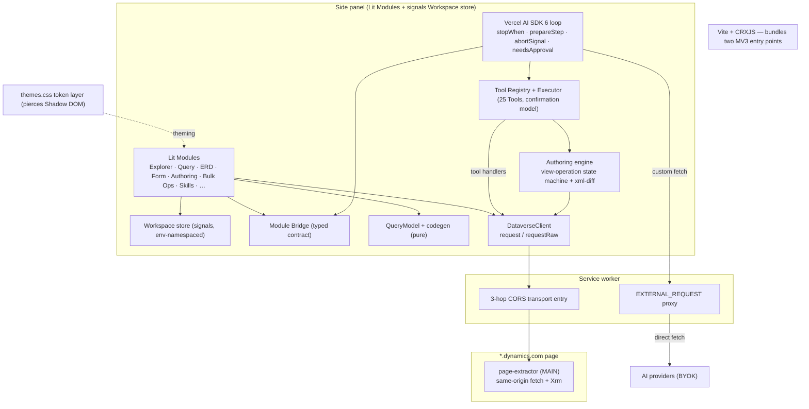

# Rewrite Foundations

> Synthesis brief for the Dataverse Toolkit rewrite. Grounded in `docs/CODEBASE-ATLAS.md` (verified ground truth of the current build), `docs/PRD.md` / ADR-0001 / ADR-0002 (product positioning + Module roster), and the framework research that follows ADR-0004's mandate. This brief picks the technical stack the rewrite stands on and writes the reuse contract for the deep Modules that survive.
>
> Optimization target, in order: **complexity reduction → MV3 fit → design/UX quality.** Where a choice trades one for another, the brief says so.
>
> Vocabulary note: this is a *Workspace* of *Modules*, each an *Agent-first UI*, jointly driven by a human and the *Agent* through *Tools*, with *Skills* as the extensibility mechanism. Terms are capitalized per `CONTEXT.md`; we never say "tab", "wizard", "AI", or "chatbot".

---

## 1. Recommended technical stack

One coherent recommendation. Each line is a single primary pick with a one-line *why*, plus the runner-up. The picks are designed to compose (see §5).

| Concern | Primary recommendation | Why (one line) | Runner-up |
|---|---|---|---|
| **Agent orchestration / loop** | **Vercel AI SDK 6** (`ai` + `@ai-sdk/openai` + `@ai-sdk/anthropic` + `@ai-sdk/azure`) | Deletes the entire bespoke text-JSON protocol — `repairJson`, control-char escaping, fence-stripping, the user/assistant flattening, the 8000-char re-stringify — and gives native tool-result roles, `stopWhen`/`stepCountIs`, `prepareStep`, `abortSignal`, and a `needsApproval` HITL gate that maps 1:1 onto the existing confirmation flow. | **Thin roll-your-own over native provider tool-calling** (no-build fallback — see §2) |
| **UI rendering** | **Lit 3** (web components, reactive properties, `html` template literals) | Each Module becomes a real custom element with encapsulated state and a declarative render — kills the imperative `injectStyles()` + full-`innerHTML`-rebuild pattern — while staying eval-free, ~6kB, and a near-1:1 mental model with the current "one class per Module, `render()` rebuilds DOM" contract. | **Preact + htm** (no-build via `htm`, but JSX/VDOM is a bigger conceptual jump from today's DOM-building Modules) |
| **CSS / design system** | **Keep `themes.css` token layer verbatim; rebuild everything else as per-Module Shadow-DOM `static styles` (Constructable Stylesheets) + a small shared primitives sheet** | Preserves the one genuinely-good asset (the ~176-property token system across `[data-theme]` + `forced-colors`) while Shadow-DOM scoping structurally eliminates the three competing CSS regimes, the BEM/inline drift, and the undefined-`var()` bugs. Tokens pierce Shadow DOM, so theming stays global. | **Tailwind** (rejected — needs a build, fights the existing token system, and bloats class soup against the design-quality goal) |
| **State + Module Bridge** | **A tiny observable Workspace store (signals) + the existing 3-method Bridge shape promoted to a typed contract** | The Bridge already works (`getModuleState` / `navigateAndConfigure` / `buildContextForPrompt`); the missing piece is one env-namespaced reactive store for shared Workspace state (selection, schema cache, connection). Signals (Lit's `@lit-labs/signals` or `@preact/signals-core`, ~1–2kB) give reactivity without a framework. | **Zustand vanilla store** (fine, but heavier than signals and redundant with Lit's reactivity) |
| **Build tooling** | **Vite + `@crxjs/vite-plugin` (or WXT)** — *contingent on the §2 owner decision* | One config handles both entry points (side-panel page + ES-module service worker), HMR in dev, `web_accessible_resources` wiring, and a CSP-clean bundled `dist/`. Toolchain (vite/esbuild/rollup) is already on disk for tests. | **esbuild-only script** (lighter, no HMR, more manual MV3 wiring) — or **no build at all** if the owner refuses (§2) |
| **Provider transport** | **Keep the service-worker `EXTERNAL_REQUEST` proxy; wire the AI SDK to a custom `fetch` that routes through it** | The SW already host-permits the BYOK trio and bypasses the CORS-blocked side-panel origin; passing a custom `fetch` to each provider factory means the SDK never calls providers directly and key handling stays exactly as today. | (no real alternative — direct side-panel→provider calls are CORS-blocked; this is non-negotiable for MV3) |

**The one coherent picture:** Lit Modules render declaratively into Shadow DOM scoped by the existing token system; they read/write one signals-based Workspace store and expose state through the typed Module Bridge; the Agent drives them through the Vercel AI SDK loop, whose provider calls tunnel through the unchanged SW `EXTERNAL_REQUEST` proxy; Vite bundles the two MV3 entry points into a CSP-clean `dist/`. Every primary pick is eval-free and MV3-CSP-clean once bundled, and every one *reduces* concept count versus the current build.

---

## 2. The build-step decision (owner's call)

This is the load-bearing decision and it is **the owner's** — the rest of the stack bends around it. ADR-0001 originally locked "no build step"; both top-tier agent frameworks (and Lit's best ergonomics) ship as npm packages with bare-specifier imports that cannot load as the manifest's raw `src/` ES modules. Adopting them reverses that decision. Here are both paths, honestly.

### Path A — Adopt a minimal build (Vite + CRXJS/WXT)

**Enables**
- The **Vercel AI SDK 6** — the single largest complexity reduction available (deletes the whole bespoke protocol layer; native tool-result roles fix the *root cause* the JSON-repair machinery exists to paper over).
- **Lit / Preact** component model — declarative render, scoped styles, real Module encapsulation.
- npm dependency hygiene: lockfiles, audits, tree-shaking, dead-code elimination, minification.
- Dev HMR for the side panel; bundled ES-module SW; automatic `web_accessible_resources` + CSP wiring.
- Best AI-assisted maintainability — the next agent/dev navigating this "Agent-first" codebase gets idioms the ecosystem (and Claude) already know.

**Costs**
- Reverses ADR-0001's "no build step." Production now ships a `dist/`, not raw `src/`; "load unpacked → done" gains a `vite build` (or `vite dev`) step.
- A live npm dependency tree replaces the one-vendored-lib posture — more supply-chain and audit surface for a security-sensitive Dataverse tool. (Provider packages move fast.)
- Bundle growth in the side panel: ~20kB gz for one provider package, ~67kB gz for the full `ai` with multiple providers — modest, but must be linted for any transitive `eval`/`new Function` (none expected from the AI SDK).
- Two-entry-point bundling has sharp edges: the SW must stay an ES module (or be bundled to one) or it breaks; output format/CSP mis-set is the classic MV3 footgun.

### Path B — Stay build-free (vanilla / eval-free libs only)

**Enables**
- Preserves ADR-0001 unchanged: `chrome://extensions → Load unpacked → done`. No `dist/`, no toolchain in the critical path.
- Smallest blast radius and supply-chain surface; keeps the one-vendored-lib discipline (libs that ship as raw ESM — Lit, Preact+htm, signals — can still be vendored).
- Full control of SW routing, timeline rendering, and the Bridge with no framework impedance-matching.

**Costs**
- **The Vercel AI SDK is off the table** (bare specifiers won't load unbundled). The best available agent path becomes the **thin roll-your-own (Option 4)**: drop the text-JSON protocol and `repairJson`, call each provider's *native* tool-calling API, and keep the existing loop/executor/Bridge. This still wins the single biggest correctness fix (native tool-result roles) — but you keep owning the loop, streaming, abort, HITL gating, and **three provider tool-call dialects** (OpenAI Chat, OpenAI Responses, Anthropic content blocks) by hand, forever.
- UI libs must be hand-vendored as raw ESM; no tree-shaking/minification means you ship more bytes and audit them yourself.
- Less ecosystem leverage; bespoke code is harder for the next agent to navigate.

### Recommendation (mark: owner's call)

**Adopt the minimal build (Path A).** The complexity-reduction goal is *defined by* what the AI SDK deletes, and that deletion is only reachable with a bundler. The toolchain is already on disk; the cost is a one-time MV3 bundling config, not ongoing friction. ADR-0001's "no build step" was a Phase-1 simplicity heuristic, not a product promise — and the rewrite's own ADR-0004 explicitly reopened it with a "bundle-weight spike in MV3 context" as the deciding test.

**But it is the owner's decision**, because it is the one trade that reverses a prior ADR and changes the install/dev story. If the owner declines, Path B + the thin roll-your-own is a fully coherent fallback that *still fixes the worst problem* (native tool roles, no `repairJson`) — it just leaves more bespoke code on the floor. **Do not adopt the AI SDK and then ship it unbundled; that path does not exist.**

---

## 3. Framework option matrix

Compact, per concern. "Complexity vs current" is relative to today's bespoke build.

### Agent orchestration / loop

| Option | MV3 fit | Build? | Complexity vs current | Verdict |
|---|---|---|---|---|
| **Vercel AI SDK 6** | clean (once bundled) | **Yes** | **much less** | **Primary.** Deletes the protocol layer; native tool roles + `needsApproval` + `stopWhen` + `abortSignal`. Forces a build. |
| LangGraph.js | clean (once bundled) | Yes | **more** | Reject for MVP. Graph/state-machine model adds nodes/edges/checkpointer concepts for a single linear loop — opposite of the goal. Revisit only if the roadmap goes genuinely multi-agent. |
| Mastra | **incompatible** | Yes | much more | Reject. Server-first (Node 22.13+); using it as intended reintroduces the backend the product forbids. |
| Thin roll-your-own (native tool-calling) | **clean** | **No** | less | **Fallback / Path B.** Drops `repairJson`, adopts native tool roles — the biggest correctness win without a framework — but you maintain the loop + 3 provider dialects by hand. |

### UI rendering

| Option | MV3 fit | Build? | Complexity vs current | Verdict |
|---|---|---|---|---|
| **Lit 3** | clean | Optional (raw ESM works; build preferred) | less | **Primary.** Web components ≈ the existing "Module class with `render()`" contract, but declarative + scoped styles. ~6kB, eval-free. |
| Preact + htm | clean | **No** (htm = no-build) | less | Strong runner-up; best *no-build* component option. JSX/VDOM is a bigger jump from today's DOM-building Modules. |
| Vanilla DOM (status quo, cleaned) | clean | No | same | Viable only if rejecting all libs; keeps imperative-DOM tax that hurts the design-quality goal. |
| React | clean (once bundled) | Yes | more | Reject. Heaviest, mandatory build, most ceremony for a side panel. |

### CSS / design system

| Option | MV3 fit | Build? | Complexity vs current | Verdict |
|---|---|---|---|---|
| **Token layer + Shadow-DOM scoped styles** | clean | No (CSS) | **much less** | **Primary.** Shadow DOM structurally ends the three-regime fragmentation; `themes.css` tokens pierce the boundary so theming stays global. |
| Single global stylesheet, BEM-disciplined | clean | No | less | Workable without Shadow DOM (Preact path), but relies on naming discipline the current build proves fails. |
| Tailwind | clean (once built) | Yes | more | Reject. Needs a build, fights the token system, class-soup works against design quality. |
| CSS-in-JS (status quo) | clean | No | same/worse | Reject — this *is* the `styles.js` anti-pattern (1,201 LOC) to delete. |

### State + Module Bridge

| Option | MV3 fit | Build? | Complexity vs current | Verdict |
|---|---|---|---|---|
| **Signals store + typed Bridge contract** | clean | No | less | **Primary.** ~1–2kB reactivity; the Bridge shape already works — just type it and env-namespace the store. |
| Zustand (vanilla) | clean | No | similar | Runner-up; heavier and redundant with Lit's own reactivity. |
| EventBus only (status quo) | clean | No | same | Reject as the *only* mechanism — manual subscription wiring is the current coupling source. |

### Build tooling

| Option | MV3 fit | Build? | Complexity vs current | Verdict |
|---|---|---|---|---|
| **Vite + CRXJS / WXT** | clean | Yes | new axis, but standard | **Primary** (if Path A). Two-entry MV3 wiring, HMR, CSP-clean `dist/`. |
| esbuild-only script | clean | Yes | less than Vite | Runner-up; lighter, no HMR, more manual MV3 plumbing. |
| No build | clean | No | same | The Path-B choice; forecloses the AI SDK + Lit-with-build. |

### Provider transport

| Option | MV3 fit | Build? | Complexity vs current | Verdict |
|---|---|---|---|---|
| **SW `EXTERNAL_REQUEST` proxy + custom `fetch`** | clean | No | same | **Primary** — the only CORS-safe path; already built and host-permitted. |
| Direct side-panel→provider | **incompatible** | No | — | Reject — CORS-blocked from the `chrome-extension://` origin (the reason the proxy exists). |

---

## 4. Deep-Module salvage catalog

> The deep-module spec input was empty, so this catalog is reconstructed from the verified `CODEBASE-ATLAS.md` salvage ledger (§8) and the discrepancy table (§9), cross-checked against ADR-0002's verdicts. **This is the reuse contract the rewrite builds on** — re-verify each "exists today" claim against code before depending on it, per the Atlas's own caution.

Each row: **reuse verdict · proposed narrow interface · hidden complexity · what to sever · bugs/dead-code to fix.**

### CORS transport bridge (SW + content-script + page-extractor, ~1,133 LOC)
- **Verdict:** **Keep** (the load-bearing trick — no rewrite touches this lightly).
- **Narrow interface:** `transport.request({ method, url, headers, body }) → { ok, status, statusText, headers, data, error }` and `transport.formInspect(action, params) → { data }`. One never-throwing envelope; callers never see the 3-hop relay.
- **Hidden complexity:** idle-kill `activeEnv` restore from `chrome.storage.session` at the top of `proxyApiRequest`; on-demand re-injection of an orphaned content script after dev reload; requestId correlation over `window.postMessage(targetOrigin:'*')`; `findDynamicsTab` can proxy through *a different org's tab* if multiple Dynamics tabs are open (env/cookie mismatch).
- **Sever:** the entire Bearer-token subsystem (`GET_TOKEN`/`SET_TOKEN`, `tokensByOrg`, `storeToken`, 55-min expiry, `__COOKIE_AUTH__` sentinel, "two strategies" JSDoc) — auth is 100% cookie-based; it is dead theater. Sever the dead `GET/SET_METADATA_CACHE` SW handlers.
- **Fix:** harden `findDynamicsTab` to bind the proxying tab to `activeEnv` (don't silently hit the wrong Environment); tighten the `postMessage` source check; document that `inspect_form`'s `getFormType` and `execute_code`'s page `executeCode` action **throw** (page-extractor implements neither).

### DataverseClient (`shared/api-client.js`, 590 LOC)
- **Verdict:** **Keep** (best-tested file in the repo; the contract everything pivots on).
- **Narrow interface:** `request(method, url, headers?, body?)` (throws on failure, returns unwrapped OData data) and `requestRaw(...)` (never throws, returns the envelope); plus `executeBatch`, `getOptionSet` (type-cast), `formInspect`, `getEnvironment`.
- **Hidden complexity:** `request()` gates on the *worker* `success` flag (not HTTP `ok`), then returns `response.data`, so callers still need `data.value || []` to strip the *OData* envelope — two envelopes, two unwraps.
- **Sever:** module-level shared interceptor arrays (move to instance state) and the dead `GET_TOKEN` path.
- **Fix:** none functional; just relocate the interceptors so two Workspaces can't cross-contaminate.

### provider-adapters (`ai-customizer/provider-adapters.js`, 243 LOC)
- **Verdict:** **Keep the knowledge, re-map onto the AI SDK** (the "gem" — only tested file in the AI stack). Under Path A this becomes a *verification checklist*, not retained code; under Path B it stays and grows.
- **Narrow interface (today):** request builders + response extractors for OpenAI/Azure/Anthropic/custom, across Responses API + Chat Completions; normalizes citations + reasoning summaries.
- **Hidden complexity:** the Responses-API path exposes reasoning effort + `summary:'auto'`, the `web_search` tool, and `url_citation` annotations that the timeline renders — these are the features that must be re-mapped onto the SDK's provider-options before this file is deleted, or timeline metadata regresses.
- **Sever:** the leak where the Chat-Completions builder forces `response_format:{type:'json_object'}` — that bound the "provider-agnostic" adapter to the bespoke JSON protocol. With native tool-calling, it's gone.
- **Fix:** confirm each Responses-API feature has an SDK equivalent *before* deleting; otherwise keep this file as the adapter (Path B).

### Query model + codegen (extracted from `fetchxml-builder.js`, 2,662 LOC)
- **Verdict:** **Rethink / split** — the logic is gold, the monolith UI is not.
- **Narrow interface:** pure, UI-free — `createEmptyModel()`, `xmlToModel(xml) → QueryModel`, `modelToXml(model)`, `modelToOData(model)`, and `codegen(model, target)` for FetchXML/OData/JS(Xrm.WebApi)/C#/Power Automate; plus `FETCH_OPERATORS` and validation.
- **Hidden complexity:** model↔XML is bidirectional and round-trip-stable; OData is **output-only** (no parser exists — ADR claims a parser that isn't there); pagination is *serialized into the model but has no execution* today.
- **Sever:** the monolithic UI class, `qb-*` strings, bespoke modals, easter-egg calls, and the rule "always generate from the model, never parse the textarea."
- **Fix:** dead `AGGREGATE_FUNCTIONS` (exported, unreferenced); de-dup the Dataverse header block replicated ×3 across codegens; if saved queries are promised (ADR-0002), they don't exist yet — build, don't salvage.

### ERD v2 pack (`erd-v2.js` orchestrator + `erd-v2/` 13 sub-modules, 3,134 LOC)
- **Verdict:** **Light refactor + use as the deep-Module architecture template** — *but the template is the thin-orchestrator + reactive-store shape, NOT the verbatim pack.*
- **Narrow interface:** `render(scope)`, `setContext({ solution, entityCount, selectedEntity })`, `getContext()`; internally a thin orchestrator over a reactive store with progressive batched entity loading, dagre Sugiyama layout, color-by-parent, and export-with-inlined-styles.
- **Hidden complexity:** the flagship "channel-routed orthogonal edges" are **dead** — only `computeSimple` (straight diagonals) runs; on drag, a *different* inline orthogonal path is drawn; crow's-foot markers are built in `defs` but never attached; the zoom-driven field-visibility system is no-op scaffolding (~400 of channel-router's 544 LOC unreachable).
- **Sever:** the dead channel-router, no-op field-visibility plumbing, unused crow's-foot markers, and the local 142-LOC DetailPanel fork.
- **Fix:** ADR-0002 said "keep as-is as template" on the strength of a feature that doesn't run — *template the orchestrator pattern, not the dead edge router*; consolidate the DetailPanel fork into the one shared component (divergent API: `show(entityName)`/`hide` vs shared `setData`/`setViewMode` — reconcile, don't swap).

### CMT / `$batch` engine (inside `bulk-operations.js` + `bulk-ops/*`, 6,814 LOC)
- **Verdict:** **Mixed — keep the core, cut the wizard tangle** (Bulk Ops is rebuilt as the "CMT on crack" flagship).
- **Narrow interface:** `buildBatchBody(operations) → multipart`, `parseBatchResponse(raw) → results[]`, `cmtRecordsToOperations(...)`, the CMT XML import/export + native-zip codec (`cmt-xml-utils`), `fetchAllRecords(...)`, and `EntityBodyBuilder.buildBody(record) → body`.
- **Hidden complexity:** the highest-value **scope-picker steps (EntityPicker / Filter / FieldSelector) live *inside* `wizard-base.js`** — the file slated for deletion. Pull them out before cutting. The CMT path builds lookups *correctly*; the dialog path does not (see bug).
- **Sever:** `WizardBase` modal stepper, all 8 wizard subclasses, `DynamicTextarea`, inlined CSS (~370), the dead `_templateBulk*` methods.
- **Fix:** **LOOKUP WRITE BUG** — `EntityBodyBuilder.buildBody` emits `_<logical>_value = guid` (the *read* projection); POST/PATCH needs `<logical>@odata.bind = /entityset(guid)`. Dialog-built operations will 400. Adopt the CMT path's correct binding everywhere. Also: two divergent CSV parsers — collapse to one.

### Tool Registry + Tool Executor (`tool-registry.js` 681 + `tool-executor.js` 107)
- **Verdict:** **Keep** — the confirmation/auto-approve model and the registry/executor split are gold and survive the framework swap.
- **Narrow interface:** `register(toolDef)`, `buildToolListForPrompt()`, and `execute(id, params, reasoning) → result` with the `onConfirmation` gate. Tool defs carry `requiresConfirmation` + `autoApprovable`.
- **Hidden complexity:** **the verified count is 25 Tools, not 28** (docs lie; contract test only asserts `>=20`); `ctx` is actually `{api, cache, log, bridge, skillManager}` (JSDoc/CLAUDE omit fields handlers depend on); auto-approve is session-only, never persisted; `delete_record` + `execute_code` are non-auto-approvable.
- **Sever:** the half-built user-tool persistence (`load()` never attaches a handler → "skill-based tools are not yet executable" — the user-tools feature is a stub); the hollow navigation "tools" (`show_erd`, `show_security`, `generate_tool_schema`, `load_*` return no data, only navigate).
- **Fix:** under Path A, re-home `requiresConfirmation` onto the SDK's `needsApproval` (1:1 map); fix the triple-source-of-truth tab identity (`ALL_TABS` vs `TAB_LABELS` vs `navigate_module` description); note `execute_action` is an arbitrary method+url+body god-Tool and `execute_code`'s page branch throws.

### Module Bridge (`ai-customizer/module-bridge.js`, 169 LOC)
- **Verdict:** **Keep the shape, promote to a typed contract** (ADR-0002 explicitly preserves the *shape*, not the implementation).
- **Narrow interface:** `getModuleState(moduleId) → ctx`, `navigateAndConfigure(moduleId, ctx)`, `buildContextForPrompt() → string`. Backed by `app.switchTab` / `getModule` / `getActiveTab`.
- **Hidden complexity:** **reaches private shell state** — reads `app._pageUrl` directly (undocumented coupling of the Agent layer to shell internals); duplicates `TAB_LABELS` as a second source of tab identity.
- **Sever:** the `_pageUrl` leak — derive page/Environment from the Workspace store instead; the duplicated label table.
- **Fix:** type the three methods; derive labels from the Module registry so there is one source of truth.

### Authoring precursor (`ai-customizer/operations/{base,view-operation}.js`, 711 LOC + `xml-diff.js`, 203)
- **Verdict:** **Rethink as the Authoring seed** — *the single biggest salvage miss*: ADR-0002 says Authoring has "no prior surface," but this is a working LLM-driven view-XML authoring precursor.
- **Narrow interface:** propose → validate → diff → apply → re-read → revert/publish, over `savedquery`/`userquery` `layoutxml` + `fetchxml`. Pair with `xml-diff`'s pure LCS line+word diff.
- **Hidden complexity:** the apply/publish/re-read/revert *state machine* and the regex validators are the reusable Authoring assets — they encode the "Approval Step with diff" primitive ADR-0002 wants for both single-op and Solution-scale Authoring.
- **Sever:** the bespoke `ac-` DOM and the coupling into the AI Customizer god-Module; move `xml-diff` to Authoring/Agent Investigation, not the chat transcript (ADR-0002 mis-routes it).
- **Fix:** dead `ViewOperation.#normalize()` (defined, never called); generalize from view-XML to the full Authoring metadata surface.

### Session Manager + Skill Manager (`session-manager.js` 158 + `skill-manager.js` 333)
- **Verdict:** **Keep the model, rebuild persistence** — the data shapes are good; the storage layer is wrong for the product.
- **Narrow interface:** sessions = multi-conversation CRUD + JSON/MD export; skills = `{ markdown, frontmatter, linkedTools }` model + the 4 system Skills + Skill-Context builder.
- **Hidden complexity:** **Skills' claimed Dataverse persistence/sharing does not exist** — it is `chrome.storage.local` only. CONTEXT.md, README, and ADR-0002 all describe a Dataverse Skill store that was never built. "Salvage the Dataverse skill model" salvages nothing — **build it from scratch** (ADR-0006 owns the ownership/sharing model).
- **Sever:** `chrome.storage` persistence (→ Dataverse for Skills, → Workspace store for sessions).
- **Fix:** `SkillManager.importFromMarkdown` passes a `linkedTools` *array* where `create()` expects an options *object* — imported Skills silently lose their linked Tools; the relevance filter never narrows (full Tool list passed in → all enabled Skills always injected); session prune is off-by-one.

### AgentTimeline (`ai-customizer/agent-timeline.js`, 275 LOC)
- **Verdict:** **Reuse, re-point the event contract** — framework-agnostic step UI.
- **Narrow interface:** consumes a stream of step events (thinking / tool / question / metadata) and renders the live timeline.
- **Hidden complexity:** today it expects discrete `onStep` callbacks; the AI SDK emits `fullStream`/`onStepFinish` parts — adapting is straightforward but is real integration work, not a drop-in.
- **Sever:** the bespoke-protocol assumptions baked into the event shape.
- **Fix:** re-point onto the SDK stream parts; surface parallel tool calls (current code assumes strictly sequential).

### Cut outright (no salvage contract)
- **ERD v1** (`erd-viewer.js`, 3,636) — cut; salvage only the A* orthogonal router + JSON-Schema/payload export as free functions. **Flip `show_erd`'s `params.pro ? 'erdv2' : 'erd'` default first** or the Agent's primary ERD path breaks.
- **Record Viewer** (`record-viewer.js`, 1,421) — dead + defective (focus-destroying re-render, wrong "Previous" page, untyped PATCH corrupting numeric/lookup/optionset fields). Study the data-grid pattern for Data Investigation; **do not port**.
- **CodeEditor** (`code-editor.js`, 1,105) — dead (zero importers; orphaned CSS). Salvage the 4 tokenizers + textarea-overlay technique; rebuild from spec.
- **shared/metadata-cache.js** (327) — dead; the *env-namespaced* one died and the *non*-namespaced in-`app.js` copy survived. Resurrect the env-namespacing into the new Workspace store.
- **system-prompts.js** (69), **styles.js** (1,201 CSS-in-JS) — cut whole.

---

## 5. How the stack + deep Modules compose

The recommended stack is a set of thin wrappers around the salvaged deep Modules — each deep Module keeps its narrow interface; the stack supplies orchestration, rendering, and reactivity around it.

- **Provider transport behind the agent framework.** The Vercel AI SDK's provider factories are constructed with a **custom `fetch`** that forwards to the SW `EXTERNAL_REQUEST` proxy. The SDK runs the native tool loop; provider HTTP never leaves the SW. provider-adapters' Responses-API knowledge becomes the SDK provider-options config.
- **Tool Registry + Executor behind the AI SDK's tool layer.** Each registry entry maps to an SDK `tool({ parameters, needsApproval, execute })`; `requiresConfirmation` → `needsApproval`; `execute` calls the existing handler with `ctx = { api, cache, log, bridge, skillManager }`. The bespoke `repairJson`/status-protocol layer is deleted — tool calls and results ride native roles.
- **Query model behind the Lit UI layer.** The pure `QueryModel` + codegen functions sit under the Query Module's Lit component; the component renders from the model and never parses its own textarea. The same model is what `execute_fetchxml`/`execute_odata` Tools and `build_query` consume.
- **CORS transport behind DataverseClient behind every Module + Tool.** `DataverseClient.request/requestRaw` is the only thing Modules and Tool handlers call; it wraps the 3-hop transport; nothing above the client knows the relay exists.
- **Module Bridge + Workspace store as the shared spine.** Every Lit Module reads/writes the env-namespaced signals store and exposes state through the typed Bridge; the AI SDK loop reads `buildContextForPrompt()` and drives Modules via `navigateAndConfigure`. ERD v2's thin-orchestrator + reactive-store shape is the template every deep Module follows.
- **Authoring precursor under the Approval-Flow UI.** The view-operation state machine + `xml-diff` become the engine behind the Authoring Module's "Approval Step with diff" primitive, surfaced through the SDK's `needsApproval` gate.

---

## 6. Owner decisions surfaced

Decisions the research says **only the owner** can make:

- **Build step (the central one).** Accept a minimal Vite/CRXJS/WXT build — and the resulting bundled `dist/` load path for both the side panel and the ES-module SW — in exchange for the Vercel AI SDK's complexity reduction and the Lit component model? This reverses ADR-0001's "no build step." **If NO, the only viable agent path is the thin roll-your-own** (Path B), and Lit must be vendored as raw ESM (or Preact+htm used). Everything else in §1 bends to this answer.
- **One-vendored-lib posture vs a live npm dependency tree.** The product currently ships exactly one vendored lib; Path A trades that for a maintained dependency surface (provider packages churn) on a security-sensitive Dataverse tool. Acceptable, or a hard constraint?
- **UI library adoption at all.** Lit/Preact vs a disciplined vanilla-DOM rebuild. The design-quality goal argues for a component library; the minimalism goal could argue for none.
- **Agent framework ceiling.** Vercel AI SDK now vs leaving room for LangGraph.js later if the roadmap goes genuinely multi-agent/branching (it adds conceptual complexity for today's single linear loop). Mastra is off the table (server-first; would reintroduce the forbidden backend).
- **Bundle-weight tolerance for the side panel.** ~20kB gz (one provider) to ~67kB gz (full `ai`, multiple providers). Modest, but it is a deliberate acceptance against the lean-payload instinct.
- **Skills persistence target (forward-looking).** The Atlas confirms the Dataverse Skill store **does not exist** — it must be built. Personal vs Team vs Solution-bundled is deferred to ADR-0006, but the owner must confirm Dataverse (not `chrome.storage`) is the persistence target the rewrite builds toward.
- **Where the design-vs-simplicity line sits.** When complexity reduction and design/UX quality conflict (e.g. Shadow-DOM scoping cost vs a single global stylesheet), which wins? The brief defaults to design quality given the product's "showcase of excellent human-Agent interaction" positioning — but that ordering is the owner's to confirm.
